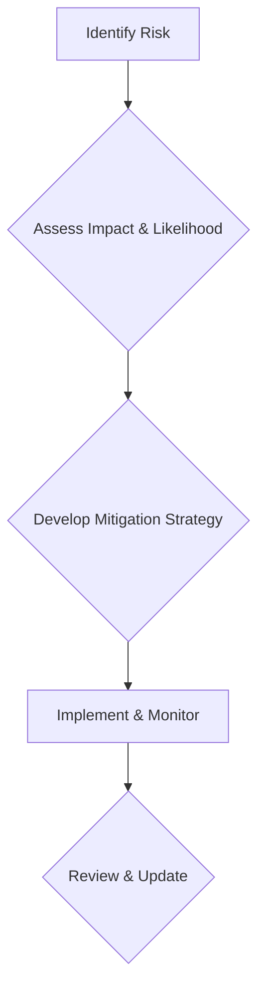
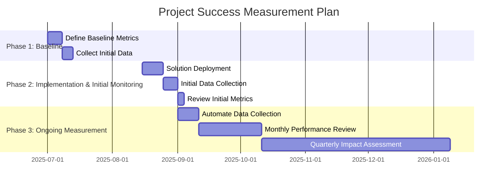

# Business Case Document

## 1. Executive Summary and Recommendation

[Provide a concise overview of the business problem, the proposed solution, and the recommended approach. Highlight the key benefits and the overall value proposition. Conclude with a clear recommendation for approval.]

## 2. Problem Analysis and Business Need

[Describe the current state and clearly articulate the business problem(s) this project aims to solve. Quantify the impact of these problems (e.g., inefficiencies, lost revenue, compliance risks). Explain the underlying business need and how it aligns with organizational strategic objectives.]

## 3. Solution Options and Recommended Approach

[Outline various potential solutions considered, including their pros, cons, and high-level cost estimates. Detail the recommended solution, explaining why it is the most suitable option to address the identified business needs and problems. Include a high-level overview of the technical approach if relevant.]

## 4. Impact Analysis

### 4.1. User Experience Impact

[Describe how the proposed solution will affect the end-user experience. Focus on improvements in usability, efficiency, and satisfaction. Consider different user personas and their interactions.]

### 4.2. Operational Efficiency Impact

[Explain how the solution will improve operational processes, reduce manual effort, streamline workflows, or optimize resource utilization. Quantify expected gains where possible.]

### 4.3. Market Positioning Impact

[If applicable, describe how the solution will enhance the organization's competitive advantage, market share, or brand reputation.]

## 5. Risk Assessment and Mitigation Strategies

[Identify potential risks associated with the project (e.g., technical, financial, operational, adoption, security, compliance). For each risk, describe its potential impact and likelihood, and outline specific mitigation strategies.]

## 6. Resource Requirements

[Detail the resources required for the project, including personnel (roles, skills), technology (hardware, software, licenses), and external services. Provide high-level estimates for each category.]

## 7. Success Metrics and Measurement Plan

[Define clear, measurable success metrics (KPIs) that will be used to evaluate the project's success post-implementation. Describe how and when these metrics will be measured and reported.]

