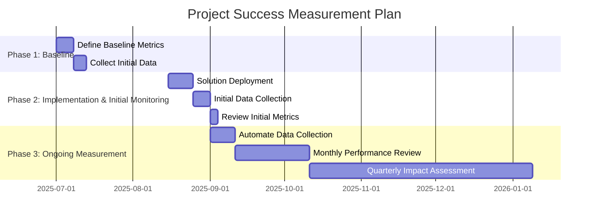

# Business Case Document

## 1. Executive Summary and Recommendation

This document outlines the business case for the Claude MCP Servers Configuration project. The project provides a unified and automated system for setting up and managing Model Context Protocol (MCP) servers across various AI platforms, including Claude Desktop, VS Code, and the Gemini CLI. The primary problem this project solves is the significant complexity and fragmentation developers face when integrating external tools with their AI assistants. The proposed solution is a comprehensive toolkit of scripts and configurations that automates the setup, management, and monitoring of MCP servers. The key benefits include a drastically reduced setup time, improved security, and a more robust and maintainable development environment. We recommend the approval of this project to enhance the developer experience and accelerate the adoption of AI-powered tools.

## 2. Problem Analysis and Business Need

Currently, developers who want to extend their AI assistants with external capabilities face several significant challenges:

*   **Fragmented Integration**: Each AI platform has its own unique and often poorly documented configuration requirements for MCP servers.
*   **Complex Setup**: The manual configuration of MCP servers is a time-consuming and error-prone process that requires a deep understanding of various technologies, including Docker, Node.js, and shell scripting.
*   **Security Risks**: There is no standardized approach to managing sensitive credentials and permissions across different platforms, leading to potential security vulnerabilities.
*   **Maintenance Overhead**: Keeping multiple MCP servers running, updated, and compatible with the latest AI platform changes is a significant and ongoing maintenance burden.

These problems lead to developer frustration, reduced productivity, and a slower adoption rate of powerful AI tools. This project directly addresses these needs by providing a centralized and automated solution.

## 3. Solution Options and Recommended Approach

Several approaches were considered to address this problem:

1.  **Manual Documentation**: Creating comprehensive documentation for each platform. This was rejected as it would not solve the problem of complex and error-prone manual configurations.
2.  **Platform-Specific Scripts**: Developing separate scripts for each AI platform. This was rejected as it would lead to code duplication and a fragmented user experience.
3.  **Unified Configuration System (Recommended)**: A single, unified system that abstracts the complexities of each platform and provides a consistent and automated experience. This is the recommended approach as it offers the best balance of usability, maintainability, and security.

The recommended solution is a toolkit of scripts and configurations that provides:

*   An automated setup script that handles dependency checks, permission settings, and environment configuration.
*   Pre-configured connector scripts for popular MCP servers.
*   A centralized configuration system using a `.env` file.
*   Health check, maintenance, and security audit utilities.

## 4. Impact Analysis

### 4.1. User Experience Impact

The proposed solution will have a significant positive impact on the developer experience:

*   **Reduced Setup Time**: The automated setup process will reduce the time it takes to configure MCP servers from hours to minutes.
*   **Lowered Barrier to Entry**: The simplified process will make it easier for developers of all skill levels to leverage the power of MCP servers.
*   **Increased Confidence**: The robust error handling and health checks will give developers more confidence in their AI development environment.

### 4.2. Operational Efficiency Impact

The solution will improve operational efficiency by:

*   **Automating Repetitive Tasks**: The scripts automate the tedious and repetitive tasks of setting up, configuring, and maintaining MCP servers.
*   **Reducing Support Overhead**: The improved documentation and troubleshooting guides will reduce the need for support from senior developers.
*   **Streamlining Development Workflows**: The unified system will allow developers to focus on building innovative AI-powered applications rather than managing complex infrastructure.

### 4.3. Market Positioning Impact

This project will position the Claude MCP Servers Configuration toolkit as a leading solution for AI-assisted development. It will attract more developers to the platform and foster a more vibrant and active community.

## 5. Risk Assessment and Mitigation Strategies

| Risk | Impact | Likelihood | Mitigation Strategy |
| :--- | :--- | :--- | :--- |
| **MCP Protocol Changes** | High | Medium | The project will use version pinning for MCP server packages and will be actively maintained to ensure compatibility with the latest protocol changes. |
| **Platform API Changes** | High | Low | The use of abstraction layers and connector scripts will help to isolate the system from platform-specific API changes. |
| **Docker Dependency** | Medium | Low | The project currently relies on Docker for some MCP servers. In the future, we may explore alternative containerization technologies or provide non-Docker alternatives. |
| **Low User Adoption** | High | Medium | We will create comprehensive documentation, tutorials, and a marketing campaign to promote the benefits of the toolkit and drive user adoption. |

## 6. Resource Requirements

The project requires the following resources:

*   **Personnel**: A lead developer with expertise in shell scripting, Docker, and Node.js. A technical writer to create and maintain the documentation.
*   **Technology**: A GitHub repository for version control and collaboration. A CI/CD pipeline for automated testing and deployment.

## 7. Success Metrics and Measurement Plan

The success of the project will be measured by the following metrics:

*   **Reduced Setup Time**: A target of reducing the average setup time from 2-4 hours to under 30 minutes.
*   **Increased User Adoption**: A target of 500+ active users within the first 3 months of release.
*   **Improved Server Uptime**: A target of 99.5% uptime for all managed MCP servers.
*   **High User Satisfaction**: A target of a 4.5-star rating or higher on GitHub.

