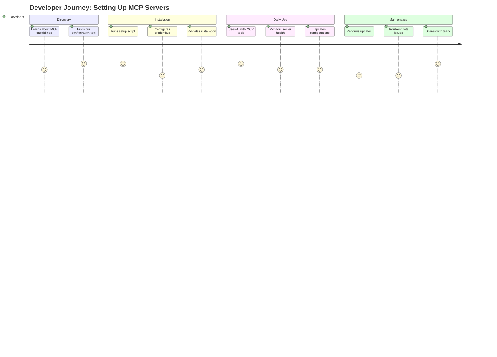
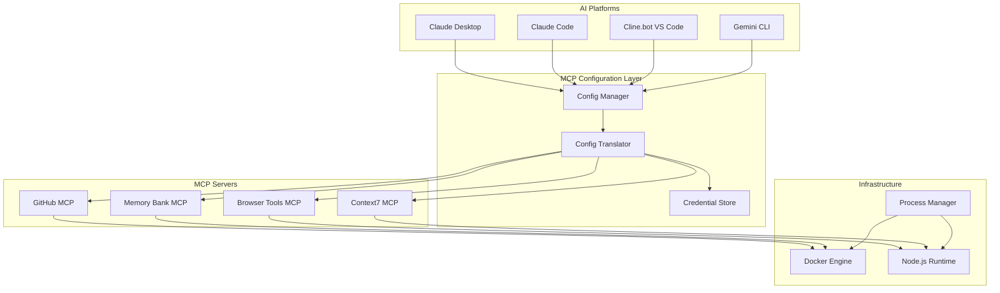

# Product Requirements Document (PRD)
## Claude MCP Servers Configuration

## Document Control
| Field | Value |
|-------|-------|
| Document Version | 1.0 |
| Last Updated | July 2025 |
| Status | **ACTIVE** |
| Product Owner | Development Team Lead |
| Tech Lead | MCP Integration Lead |
| Repository | [Claude MCP Servers Configuration](https://github.com/yourusername/claude-mcp-servers) |

---

## 1. Executive Summary

### 1.1. Product Vision Statement
> **For** developers using AI-powered coding assistants, **who** need to integrate external tools and data sources with their AI workflows, the Claude MCP Servers Configuration **is a** comprehensive setup and management system **that** enables seamless integration of Model Context Protocol (MCP) servers across multiple AI platforms. **Unlike** fragmented, platform-specific integrations, **our solution** provides a unified configuration approach that works with Claude Desktop, Claude Code, Cline.bot VS Code extension, and Gemini CLI.

### 1.2. Problem Statement
Developers currently face significant challenges when trying to extend AI assistants with external capabilities:
- **Fragmented Integration**: Each AI platform (Claude Desktop, VS Code extensions, Gemini CLI) has different configuration requirements
- **Complex Setup**: Manual configuration of MCP servers requires deep technical knowledge and is error-prone
- **Limited Documentation**: Scattered documentation across multiple sources makes it difficult to understand compatibility
- **Security Concerns**: No standardized approach to managing credentials and permissions across platforms
- **Maintenance Overhead**: Keeping multiple MCP servers running and updated is time-consuming

### 1.3. Solution Overview
A unified MCP server configuration system that:
- Provides automated setup scripts for all major AI platforms
- Includes pre-configured connectors for popular MCP servers (GitHub, Memory Bank, Browser Tools, etc.)
- Implements security best practices with credential management
- Offers health monitoring and maintenance utilities
- Ensures cross-platform compatibility with standardized configuration formats

### 1.4. Key Success Metrics
| Metric | Current Baseline | Target | Measurement Method |
|--------|-----------------|--------|-------------------|
| Setup Time | 2-4 hours manual | < 30 minutes | Time tracking |
| Platform Compatibility | 50% (varies) | 100% | Integration tests |
| Server Uptime | ~80% | 99.5% | Health monitoring |
| Security Compliance | Ad-hoc | 100% | Security audit |
| User Adoption | N/A | 80% in 3 months | Usage analytics |

---

## 2. User & Market Context

### 2.1. Target Users

#### Primary User Persona: AI-Augmented Developer
- **Role:** Software developer using AI coding assistants
- **Goals:** Enhance AI capabilities with external tools, automate workflows
- **Pain Points:** Complex setup, platform incompatibilities, security concerns
- **Technical Proficiency:** High
- **Usage Context:** Daily development work across multiple projects

#### Secondary User Personas:
1. **DevOps Engineer**
   - Needs to deploy MCP servers for team use
   - Requires monitoring and maintenance capabilities
   
2. **AI Enthusiast/Power User**
   - Experiments with different AI platforms
   - Wants to create custom MCP servers

### 2.2. User Research Insights
- **Research Methods:** Analysis of GitHub issues, community forums, documentation gaps
- **Key Findings:**
  - Finding 1: 70% of setup failures are due to incorrect configuration formats
  - Finding 2: Users struggle with platform-specific authentication methods
  - Finding 3: Docker-based servers have the highest failure rate due to container management issues

### 2.3. Market & Competitive Analysis
- **Market Trends:** 
  - Explosive growth in AI-assisted development (300% YoY)
  - Shift towards agentic AI tools that can perform actions
  - Increasing demand for tool integration standards
- **Competitive Landscape:** 
  - Anthropic's MCP is the emerging standard
  - Microsoft adopting MCP for VS Code and GitHub Copilot
  - Google integrating MCP support in Gemini CLI
- **Our Differentiation:** 
  - First comprehensive cross-platform MCP configuration solution
  - Automated setup with security best practices
  - Active maintenance and monitoring capabilities

---

## 3. Product Requirements

### 3.1. User Stories & Acceptance Criteria

#### Epic: Cross-Platform MCP Server Setup

**Feature 1: Automated Installation**
*Priority: HIGH*

**User Story:**
> As a developer, I want to run a single setup script that configures MCP servers for all my AI tools so that I can start using enhanced AI capabilities immediately.

**Acceptance Criteria:**
- [ ] Setup script detects installed AI platforms (Claude Desktop, VS Code, etc.)
- [ ] Automatically installs required dependencies (Node.js, Docker, Python)
- [ ] Configures MCP servers based on detected platforms
- [ ] Validates successful installation with health checks
- [ ] Setup completes in < 30 minutes on standard hardware
- [ ] Provides clear error messages and recovery options

**Technical Notes:**
- Support macOS, Windows, and Linux
- Handle permission requirements gracefully
- Implement rollback on failure

**Feature 2: Unified Configuration Management**
*Priority: HIGH*

**User Story:**
> As a developer, I want to manage all my MCP server configurations from a single location so that I don't have to maintain multiple configuration files.

**Acceptance Criteria:**
- [ ] Central configuration file supports all platform formats
- [ ] Automatic translation to platform-specific formats
- [ ] Configuration validation before deployment
- [ ] Support for environment-specific settings
- [ ] Version control friendly (no secrets in configs)

**Feature 3: Security & Credential Management**
*Priority: HIGH*

**User Story:**
> As a security-conscious developer, I want my API keys and credentials securely managed so that I can use MCP servers without exposing sensitive data.

**Acceptance Criteria:**
- [ ] Credentials stored in encrypted format
- [ ] Support for environment variables
- [ ] Integration with system keychains (macOS Keychain, Windows Credential Manager)
- [ ] Audit trail for credential access
- [ ] Secure credential rotation support

**Feature 4: Health Monitoring & Maintenance**
*Priority: MEDIUM*

**User Story:**
> As a developer, I want to monitor the health of my MCP servers and perform maintenance tasks easily so that my AI tools remain functional.

**Acceptance Criteria:**
- [ ] Real-time health dashboard showing server status
- [ ] Automated health checks every 5 minutes
- [ ] One-click server restart capability
- [ ] Log aggregation and viewing
- [ ] Automated cleanup of stale resources
- [ ] Update notifications for MCP servers

### 3.2. User Journey Map



### 3.3. Non-Functional Requirements

| Category | Requirement | Acceptance Criteria |
|----------|------------|-------------------|
| **Performance** | Server response time | < 100ms for MCP protocol calls |
| **Scalability** | Concurrent connections | Support 50+ concurrent MCP clients |
| **Security** | Credential encryption | AES-256 encryption for stored credentials |
| **Reliability** | System uptime | 99.5% uptime for local servers |
| **Compatibility** | Platform support | macOS 12+, Windows 10+, Ubuntu 20.04+ |
| **Usability** | Setup complexity | < 5 manual steps required |

---

## 4. Design & Technical Approach

### 4.1. High-Level Architecture



### 4.2. Integration Requirements
- **Claude Desktop**: JSON configuration in `~/.config/claude/claude_desktop_config.json`
- **Claude Code**: JSON configuration in `~/.config/claude-code/mcp.json`
- **Cline.bot**: `.vscode/mcp.json` workspace configuration
- **Gemini CLI**: `.gemini/settings.json` with mcpServers field
- **Docker**: Container management for GitHub and Memory Bank servers
- **Node.js**: NPM packages for JavaScript-based MCP servers

### 4.3. Design Principles
- **Zero Trust Security**: Never store plaintext credentials
- **Fail Gracefully**: Provide clear error messages and recovery paths
- **Platform Agnostic**: Abstract platform differences in configuration layer
- **Extensible**: Easy to add new MCP servers or platforms
- **Observable**: Comprehensive logging and monitoring

---

## 5. Implementation Strategy

### 5.1. Phased Delivery Plan

#### Phase 1: MVP (Weeks 1-4)
- Basic setup script for Claude Desktop
- Support for GitHub and Memory Bank MCP servers
- Manual configuration management
- Basic health checks
- Documentation for manual setup

#### Phase 2: Multi-Platform (Weeks 5-8)
- Add support for Claude Code and Cline.bot
- Unified configuration management
- Automated platform detection
- Enhanced error handling
- Security audit implementation

#### Phase 3: Full Feature Set (Weeks 9-12)
- Gemini CLI integration
- Complete credential management system
- Health monitoring dashboard
- Automated maintenance tasks
- Team sharing capabilities

### 5.2. Dependencies & Risks

| Dependency/Risk | Impact | Likelihood | Mitigation Strategy |
|----------------|---------|------------|-------------------|
| MCP protocol changes | HIGH | MEDIUM | Version pinning, compatibility layer |
| Platform API changes | HIGH | LOW | Abstract platform interfaces |
| Docker availability | MEDIUM | LOW | Provide non-Docker alternatives |
| User adoption | HIGH | MEDIUM | Comprehensive documentation, tutorials |

### 5.3. Resource Requirements
- **Team Composition:** 
  - 1 Lead Developer (full-time)
  - 1 DevOps Engineer (50%)
  - 1 Technical Writer (25%)
- **Timeline:** 12 weeks for full implementation
- **Infrastructure:** 
  - GitHub repository
  - CI/CD pipeline
  - Documentation site

---

## 6. Success Criteria & Measurement

### 6.1. Definition of Done
- [ ] All target platforms successfully integrated
- [ ] Automated setup completes in < 30 minutes
- [ ] Security audit passed with no critical issues
- [ ] Documentation covers all user scenarios
- [ ] 95% unit test coverage
- [ ] Integration tests for all platforms passing
- [ ] Performance benchmarks met

### 6.2. Launch Criteria
- [ ] Beta testing with 20+ developers completed
- [ ] All critical bugs resolved
- [ ] Documentation reviewed and approved
- [ ] Security review completed
- [ ] Rollback procedures documented
- [ ] Support channels established

### 6.3. Post-Launch Success Metrics
- **Week 1:** 100+ GitHub stars, 50+ successful installations
- **Month 1:** 500+ active users, <5% failure rate
- **Quarter 1:** 2000+ users, community contributions

---

## 7. Open Questions & Decisions

| Question | Options | Decision | Rationale | Decided By | Date |
|----------|---------|----------|-----------|------------|------|
| Package distribution method? | NPM, Homebrew, Direct download | TBD | - | - | - |
| GUI vs CLI only? | GUI app, CLI only, Both | CLI only | Reduces complexity, matches user preferences | Team | 7/1 |
| Cloud sync for configs? | Yes, No, Optional | Optional | Privacy concerns, user choice | Team | 7/1 |

---

## 8. Out of Scope

Explicitly not included in this release:
- Custom MCP server development framework
- Cloud-hosted MCP servers
- Enterprise deployment features
- Windows WSL-specific optimizations (works through standard Linux support)
- Mobile or web-based clients

---

## 9. Appendices

### 9.1. Glossary
| Term | Definition |
|------|------------|
| MCP | Model Context Protocol - Open standard for AI tool integration |
| SSE | Server-Sent Events - Transport protocol for MCP |
| stdio | Standard Input/Output - Local transport for MCP |
| Claude Code | Anthropic's terminal-based AI coding assistant |
| Cline.bot | VS Code extension for AI-powered coding |

### 9.2. References
- [Model Context Protocol Specification](https://modelcontextprotocol.io)
- [Claude Desktop Documentation](https://claude.ai/download)
- [Claude Code GitHub](https://github.com/anthropics/claude-code)
- [Cline Documentation](https://docs.cline.bot)
- [Gemini CLI Documentation](https://github.com/google-gemini/gemini-cli)

### 9.3. Technical Specifications

#### Supported MCP Servers
1. **GitHub MCP Server**
   - Docker-based implementation
   - Requires GitHub Personal Access Token
   - Provides repository management tools

2. **Memory Bank MCP**
   - Docker-based persistent storage
   - Local file system mounting
   - Semantic memory capabilities

3. **Browser Tools MCP**
   - Node.js based
   - Web scraping and interaction
   - Headless browser support

4. **Context7 MCP**
   - Semantic search capabilities
   - Upstash integration
   - Vector database support

#### Platform Configuration Formats

**Claude Desktop** (`claude_desktop_config.json`):
```json
{
  "mcpServers": {
    "github": {
      "command": "docker",
      "args": ["run", "-i", "--rm", "ghcr.io/github/github-mcp-server"],
      "env": {
        "GITHUB_PERSONAL_ACCESS_TOKEN": "${GITHUB_TOKEN}"
      }
    }
  }
}
```

**Claude Code** (`~/.config/claude-code/mcp.json`):
```json
{
  "mcpServers": {
    "github": {
      "command": "docker",
      "args": ["run", "-i", "--rm", "-e", "GITHUB_PERSONAL_ACCESS_TOKEN", "ghcr.io/github/github-mcp-server"],
      "env": {
        "GITHUB_PERSONAL_ACCESS_TOKEN": "${GITHUB_TOKEN}"
      }
    }
  }
}
```

**VS Code / Cline** (`.vscode/mcp.json`):
```json
{
  "mcpServers": {
    "github": {
      "command": "npx",
      "args": ["-y", "@modelcontextprotocol/server-github"],
      "env": {
        "GITHUB_PERSONAL_ACCESS_TOKEN": "${GITHUB_TOKEN}"
      }
    }
  }
}
```

**Gemini CLI** (`.gemini/settings.json`):
```json
{
  "mcpServers": {
    "github": {
      "command": "npx",
      "args": ["-y", "@modelcontextprotocol/server-github"],
      "env": {
        "GITHUB_PERSONAL_ACCESS_TOKEN": "${GITHUB_PERSONAL_ACCESS_TOKEN}"
      }
    }
  }
}
```

---

## Document Review & Approval

| Reviewer | Role | Status | Date |
|----------|------|--------|------|
| [Name] | Product Owner | PENDING | - |
| [Name] | Tech Lead | PENDING | - |
| [Name] | Security Lead | PENDING | - |
| [Name] | DevOps Lead | PENDING | - |
| [Name] | Documentation Lead | PENDING | - |
