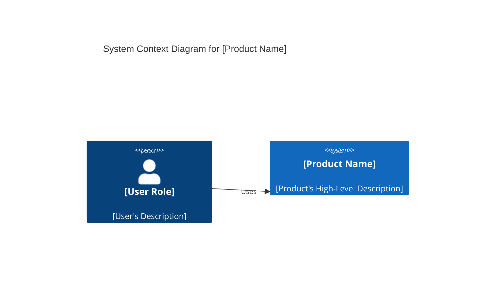
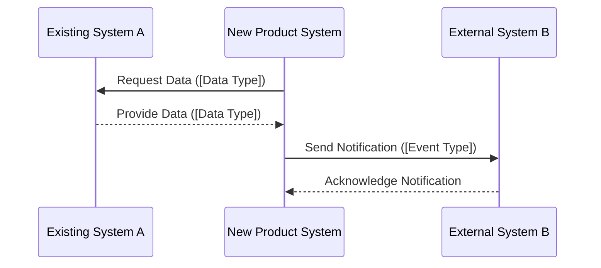

# Technical Requirements Document (TRD)

## 1. System Architecture and Design

[Describe the overall system architecture, including major components, their interactions, and deployment considerations. Provide a high-level overview of how the system will be structured.]

## 2. Technology Stack and Platform Requirements

[Specify the programming languages, frameworks, databases, operating systems, and other technologies that will be used. Justify the choices and outline any specific version requirements.]

## 3. Integration Specifications

[Detail how the system will integrate with other internal or external systems. Include API specifications, data exchange formats, and communication protocols.]

## 4. Data Architecture and Models

[Describe the high-level data architecture, including data storage mechanisms, data flow, and data processing. Reference the detailed data models in `07-data-requirements.md`.]

## 5. Security and Compliance Requirements

[Outline the security measures to be implemented (e.g., authentication, authorization, encryption, access control). List all relevant compliance standards (e.g., GDPR, HIPAA, industry-specific regulations) that the system must adhere to.]

## 6. Performance and Scalability Requirements

[Define specific performance metrics (e.g., response times, throughput, latency) and scalability goals (e.g., number of concurrent users, data volume growth). Describe how the system will handle increasing loads.]

## 7. Development and Deployment Standards

[Specify coding standards, version control practices, testing methodologies, and deployment procedures. Outline the CI/CD pipeline and environment configurations.]
