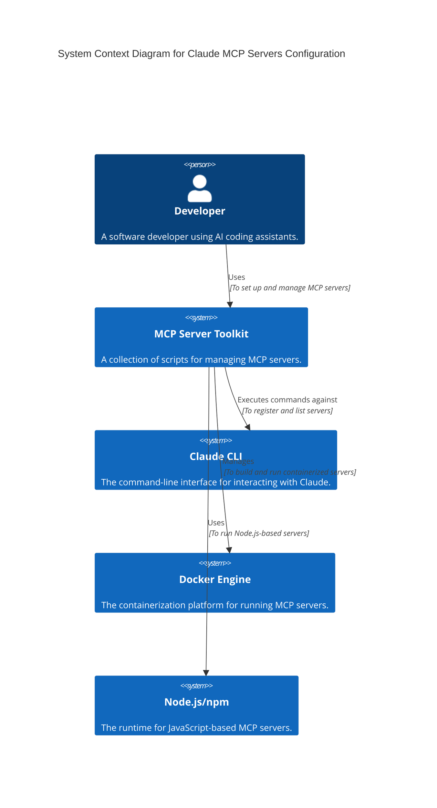

# Technical Requirements Document (TRD)

## 1. System Architecture and Design

The Claude MCP Servers Configuration toolkit is designed as a collection of shell scripts that automate the setup, management, and monitoring of Model Context Protocol (MCP) servers. The architecture is centered around a main `setup.sh` script that initializes the environment, and a `vscode-integration/start-servers.sh` script that registers the MCP servers with the `claude` CLI.

## 2. Technology Stack and Platform Requirements

*   **Programming Language**: Bash (for all scripts)
*   **Containerization**: Docker (for GitHub and Memory Bank MCP servers)
*   **JavaScript Runtime**: Node.js and npm (for Context7, Browser Tools, and Puppeteer MCP servers)
*   **Operating Systems**: The primary target is macOS. Support for Windows (via WSL2) and Linux is planned for the future.
*   **Dependencies**: `curl` (for health checks)

## 3. Integration Specifications

*   **Claude CLI**: The scripts integrate with the `claude mcp` command to add, remove, and list MCP servers.
*   **GitHub MCP Server**: The `github-mcp-connector.sh` script connects to a running Docker container for the GitHub MCP server.
*   **Memory Bank MCP Server**: The `memory-bank-connector.sh` script manages the lifecycle of the Memory Bank Docker container.
*   **Node.js Servers**: The `start-servers.sh` script uses `npx` to run the JavaScript-based MCP servers.

## 4. Data Architecture and Models

The MCP Server Toolkit itself is stateless. However, it manages the data for the following servers:

*   **Memory Bank MCP Server**: Stores data in `data/memory-bank/memory.json`.
*   **Knowledge Graph MCP Server**: (Currently disabled) Would store data in `data/knowledge-graph/kg.db`.

The data is managed within the project directory and is not otherwise processed or stored by the toolkit.

## 5. Security and Compliance Requirements

*   **Secrets Management**: All sensitive data, such as the `GITHUB_PERSONAL_ACCESS_TOKEN`, is stored in a `.env` file, which is excluded from version control by `.gitignore`.
*   **Secure Permissions**: The `setup.sh` script sets secure permissions (`600`) on the `config/config.sh` file to prevent unauthorized access.
*   **Security Audits**: The `security-audit.sh` script checks for common security vulnerabilities, such as exposed tokens and loose file permissions.

## 6. Performance and Scalability Requirements

*   **Setup Time**: The `setup.sh` script should complete in under one minute.
*   **Server Start Time**: The `start-servers.sh` script should register all servers in under 30 seconds.
*   **Resource Consumption**: The scripts themselves have minimal resource consumption. The overall resource usage is determined by the MCP servers being run.

## 7. Development and Deployment Standards

*   **Coding Standards**: All shell scripts must adhere to the Google Shell Style Guide.
*   **Version Control**: All code is managed in a Git repository on GitHub.
*   **Testing**: A comprehensive test suite using shell scripting is provided in the `tests/` directory. All tests must pass before any changes are merged to the main branch.
*   **Deployment**: The project is deployed by cloning the Git repository. There is no formal deployment process beyond that.
