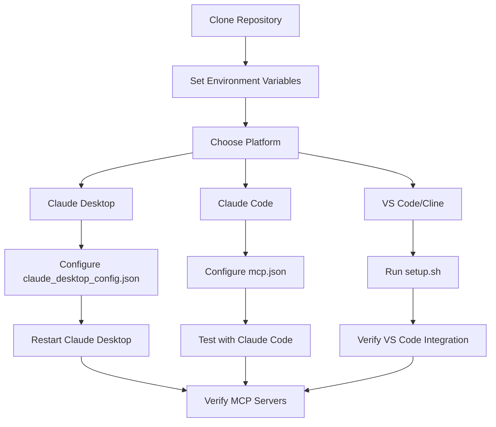
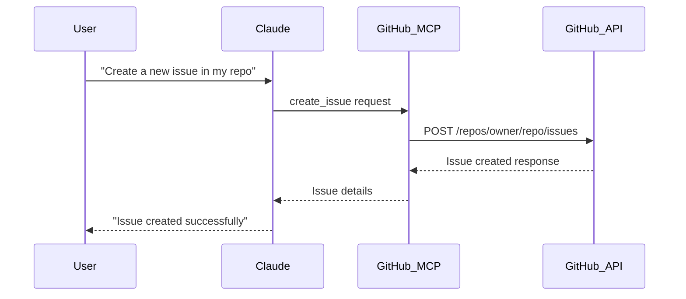
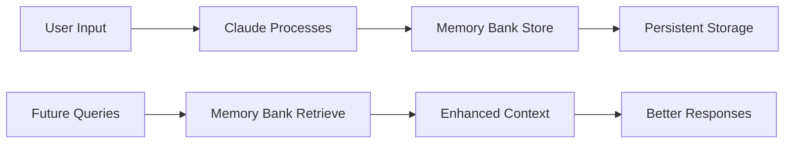
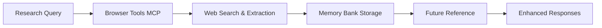

# User Guide
## Claude MCP Servers Configuration

## Document Control
| Field | Value |
|-------|-------|
| Document Version | 1.0 |
| Last Updated | July 2025 |
| Status | **ACTIVE** |
| Document Owner | Development Team |
| Audience | End Users, Developers |

---

## 1. Getting Started

### 1.1. Prerequisites

Before setting up MCP servers, ensure you have:

- **Operating System**: macOS 12+, Windows 10+, or Ubuntu 20.04+
- **Docker Desktop**: Primary requirement for MCP server deployment
- **Node.js**: Version 16+ (fallback for Jan.ai integration and legacy systems)
- **Git**: For cloning the repository and building custom images
- **Claude Desktop, Claude Code, or VS Code**: Target AI platform

### 1.2. Docker Setup Requirements

The toolkit now uses a **Docker-first strategy** for better security, isolation, and consistency:

```bash
# Verify Docker installation
docker --version
# Should return: Docker version 20.10.0 or higher

# Verify Docker is running
docker ps
# Should return container list without errors

# Test Docker functionality
docker run hello-world
# Should complete successfully
```

**Docker Image Requirements:**
- **Pre-built Images**: Pulled directly from registries (recommended)
- **Custom Build Images**: Built locally for Context7, Sequential Thinking, Memory Bank
- **Storage**: ~2GB free space for Docker images
- **Network**: Internet access for pulling images and building custom ones

### 1.2. Installation Overview



---

## 2. Platform-Specific Setup Guides

### 2.1. Claude Desktop Setup

#### Step 1: Environment Setup
```bash
# Clone the repository
git clone https://github.com/aporb/claude-mcp-server-toolkit.git
cd claude-mcp-server-toolkit

# Set up environment variables
cp .env.template .env
nano .env  # Add your GitHub token and other credentials
```

#### Step 2: Build Docker Images
```bash
# Build the Memory Bank MCP server image
bash scripts/build-memory-bank.sh
```

#### Step 3: Pull/Build Docker Images
```bash
# Pull pre-built images
docker pull ghcr.io/github/github-mcp-server
docker pull mcp/atlassian
docker pull mcp/server-filesystem
docker pull mcp/server/git
docker pull mcp/server-memory
docker pull mcp/browser-tools-mcp
docker pull zcaceres/fetch-mcp

# Build custom images
git clone https://github.com/upstash/context7-mcp.git
cd context7-mcp && docker build -t context7-mcp .
cd ..

git clone https://github.com/modelcontextprotocol/servers.git
cd servers && docker build -t mcp/sequentialthinking -f src/sequentialthinking/Dockerfile .
cd ..
```

#### Step 4: Configure Claude Desktop
Create or edit `~/.config/claude/claude_desktop_config.json`:

```json
{
  "mcpServers": {
    "atlassian": {
      "command": "docker",
      "args": ["run", "--rm", "-e", "CONFLUENCE_URL", "-e", "CONFLUENCE_USERNAME", "-e", "CONFLUENCE_API_TOKEN", "-e", "JIRA_URL", "-e", "JIRA_USERNAME", "-e", "JIRA_API_TOKEN", "mcp/atlassian"],
      "env": {
        "CONFLUENCE_URL": "https://your-domain.atlassian.net/wiki",
        "CONFLUENCE_USERNAME": "your-email@domain.com",
        "CONFLUENCE_API_TOKEN": "your_confluence_token",
        "JIRA_URL": "https://your-domain.atlassian.net",
        "JIRA_USERNAME": "your-email@domain.com",
        "JIRA_API_TOKEN": "your_jira_token"
      }
    },
    "github": {
      "command": "docker",
      "args": ["run", "-i", "--rm", "-e", "GITHUB_PERSONAL_ACCESS_TOKEN", "ghcr.io/github/github-mcp-server"],
      "env": {
        "GITHUB_PERSONAL_ACCESS_TOKEN": "your_github_token"
      }
    },
    "filesystem": {
      "command": "docker",
      "args": ["run", "--rm", "-v", "/Users/username/Desktop:/mnt/desktop", "-v", "/Users/username/Downloads:/mnt/downloads", "mcp/server-filesystem", "/mnt/desktop", "/mnt/downloads"]
    },
    "git": {
      "command": "docker",
      "args": ["run", "--rm", "-v", "/path/to/your/repo:/repo", "mcp/server/git"]
    },
    "memory": {
      "command": "docker",
      "args": ["run", "--rm", "-i", "-v", "$(pwd)/data/memory:/app/data", "mcp/server-memory"]
    },
    "browser-tools": {
      "command": "docker",
      "args": ["run", "--rm", "-i", "mcp/browser-tools-mcp"]
    },
    "context7": {
      "command": "docker",
      "args": ["run", "--rm", "-i", "context7-mcp"]
    },
    "fetch": {
      "command": "docker",
      "args": ["run", "--rm", "-i", "zcaceres/fetch-mcp"]
    },
    "sequential-thinking": {
      "command": "docker",
      "args": ["run", "--rm", "-i", "mcp/sequentialthinking"]
    },
    "jan-ai": {
      "command": "npx",
      "args": ["-y", "jan-mcp-server"],
      "env": {
        "JAN_API_KEY": "your_jan_api_key"
      }
    }
  }
}
```

#### Step 4: Verification
1. **Restart Claude Desktop**
2. **Look for MCP slider icon** in the chat input area
3. **Test MCP functionality** by asking Claude to interact with GitHub

### 2.2. Claude Code Setup

#### Step 1: Environment Setup (Same as Claude Desktop)
```bash
# Clone and set up environment
git clone https://github.com/aporb/claude-mcp-server-toolkit.git
cd claude-mcp-server-toolkit
cp .env.template .env
nano .env
```

#### Step 2: Build Docker Images
```bash
bash scripts/build-memory-bank.sh
```

#### Step 3: Configure Claude Code
Create `~/.config/claude-code/mcp.json`:

```json
{
  "mcpServers": {
    "github": {
      "command": "docker",
      "args": ["run", "-i", "--rm", "-e", "GITHUB_PERSONAL_ACCESS_TOKEN", "ghcr.io/github/github-mcp-server"]
    },
    "context7": {
      "command": "npx",
      "args": ["-y", "@upstash/context7-mcp@latest"]
    },
    "browser-tools": {
      "command": "npx",
      "args": ["-y", "@agentdeskai/browser-tools-mcp@latest"]
    },
    "puppeteer": {
      "command": "npx", 
      "args": ["-y", "puppeteer-mcp-server"]
    },
    "memory-bank": {
      "command": "bash",
      "args": ["/full/path/to/scripts/memory-bank-connector.sh"]
    },
    "filesystem": {
      "command": "npx",
      "args": ["-y", "@modelcontextprotocol/server-filesystem", "/Users/username/Desktop", "/Users/username/Downloads"]
    }
  }
}
```

#### Step 4: Verification
```bash
# Start Claude Code
claude

# Test MCP functionality
/mcp  # Should show available MCP servers
```

### 2.3. VS Code/Cline Setup

#### Step 1: Automated Setup
```bash
# Clone and run setup script
git clone https://github.com/aporb/claude-mcp-server-toolkit.git
cd claude-mcp-server-toolkit
bash setup.sh
```

#### Step 2: VS Code Integration
The setup script automatically creates `.vscode/tasks.json` for auto-starting MCP servers.

#### Step 3: Verification
1. **Open VS Code** in the project directory
2. **Check Cline extension** for MCP server availability
3. **Test functionality** through Cline interface

---

## 3. Common Workflows

### 3.1. GitHub Integration Workflow



**Example Commands:**
- "List my GitHub repositories"
- "Create a new issue in [repo] with title '[title]'"
- "Show me the latest commits in [repo]"
- "Create a pull request from [branch] to main"

### 3.2. Memory Bank Workflow



**Example Commands:**
- "Remember that I prefer TypeScript for new projects"
- "What do you remember about my coding preferences?"
- "Store this API endpoint for future reference"

### 3.3. Browser Tools Workflow

**Example Commands:**
- "Search for the latest documentation on [topic]"
- "Take a screenshot of [website]"
- "Extract text content from [URL]"
- "Fill out this form with the provided data"

### 3.4. File System Integration

**Example Commands:**
- "List files in my Desktop folder"
- "Create a new project structure in Downloads"
- "Read the contents of [file]"
- "Move all images to a new folder"

---

## 4. Best Practices

### 4.1. Security Best Practices

#### Token Management
```bash
# Use environment variables for sensitive data
export GITHUB_PERSONAL_ACCESS_TOKEN="your_token_here"

# Set secure file permissions
chmod 600 ~/.config/claude/claude_desktop_config.json
chmod 600 ~/.config/claude-code/mcp.json
```

#### Regular Security Audits
```bash
# Run the built-in security audit
bash scripts/security-audit.sh
```

### 4.2. Performance Optimization

#### Container Management
```bash
# Clean up Docker containers regularly
docker system prune -f

# Monitor container resource usage
docker stats
```

#### Health Monitoring
```bash
# Regular health checks
bash scripts/health-check.sh

# Monitor logs
tail -f logs/startup.log
```

### 4.3. Maintenance Workflows

#### Weekly Maintenance
```bash
# Update MCP servers
bash scripts/maintenance.sh

# Check for security issues
bash scripts/security-audit.sh
```

#### Monthly Maintenance
```bash
# Clean up old containers and images
bash scripts/cleanup.sh

# Update dependencies
npm update -g @upstash/context7-mcp@latest
npm update -g @agentdeskai/browser-tools-mcp@latest
npm update -g puppeteer-mcp-server
```

---

## 5. Troubleshooting Quick Reference

### 5.1. Common Issues

| Issue | Symptoms | Quick Fix |
|-------|----------|-----------|
| **No MCP slider in Claude Desktop** | Missing UI element | Restart Claude Desktop, check config syntax |
| **GitHub MCP server failed** | ✘ failed status | Check Docker container, update container ID |
| **Permission denied** | Script execution errors | `chmod +x scripts/*.sh` |
| **Node.js not found** | NPM command errors | Install Node.js from nodejs.org |
| **Docker not running** | Container errors | Start Docker Desktop |

### 5.2. Diagnostic Commands

```bash
# Check MCP server status
claude mcp list

# Test GitHub MCP connector
echo '{"jsonrpc":"2.0","id":1,"method":"initialize"}' | bash scripts/github-mcp-connector.sh

# Check Docker containers
docker ps --filter ancestor=ghcr.io/github/github-mcp-server

# Validate configuration files
cat ~/.config/claude/claude_desktop_config.json | jq .
cat ~/.config/claude-code/mcp.json | jq .
```

### 5.3. Getting Help

1. **Check the troubleshooting guide**: `TROUBLESHOOTING.md`
2. **Run health check**: `bash scripts/health-check.sh`
3. **Review logs**: `cat logs/startup.log`
4. **Create GitHub issue**: Include logs and configuration details

---

## 6. Advanced Configuration

### 6.1. Custom Server Paths

For non-standard installations, update paths in configuration files:

```json
{
  "mcpServers": {
    "memory-bank": {
      "command": "bash",
      "args": ["/custom/path/to/scripts/memory-bank-connector.sh"]
    }
  }
}
```

### 6.2. Multiple Environment Setup

Create separate configurations for different environments:

```bash
# Development environment
cp .env.template .env.dev
# Staging environment  
cp .env.template .env.staging
# Production environment
cp .env.template .env.prod
```

### 6.3. Custom MCP Server Integration

To add new MCP servers:

1. **Install the server**: `npm install -g new-mcp-server`
2. **Add to configuration**:
   ```json
   {
     "mcpServers": {
       "new-server": {
         "command": "npx",
         "args": ["-y", "new-mcp-server"]
       }
     }
   }
   ```
3. **Restart the AI platform**
4. **Test functionality**

---

## 7. Migration Guide

### 7.1. From Manual Setup

If you previously configured MCP servers manually:

1. **Backup existing configurations**
2. **Run the setup script**: `bash setup.sh`
3. **Migrate custom settings**
4. **Test all functionality**

### 7.2. Between Platforms

To move configurations between Claude Desktop and Claude Code:

```bash
# Convert Claude Desktop config to Claude Code format
# (Manual process - see platform-specific sections above)
```

---

## 8. Integration Examples

### 8.1. Complete Development Workflow

```mermaid
flowchart TD
    A[Start Development] --> B[Claude: "Create new repo structure"]
    B --> C[GitHub MCP: Creates repository]
    C --> D[Filesystem MCP: Creates local files]
    D --> E[Claude: "Research best practices"]
    E --> F[Browser Tools: Searches documentation]
    F --> G[Memory Bank: Stores preferences]
    G --> H[Claude: "Generate initial code"]
    H --> I[Development Complete]
```

### 8.2. Research and Documentation



This user guide provides comprehensive coverage of setup, workflows, and best practices for the Claude MCP Server Toolkit. Users can follow platform-specific instructions and refer to troubleshooting sections as needed.
