# User Guide
## Multi-Platform AI Assistant Configuration

## Document Control
| Field | Value |
|-------|-------|
| Document Version | 2.0 |
| Last Updated | January 2025 |
| Status | **ACTIVE** |
| Document Owner | Development Team |
| Audience | End Users, Developers |

---

## 1. Getting Started

### 1.1. Prerequisites

Before setting up MCP servers, ensure you have:

- **Operating System**: macOS 12+, Windows 10+, or Ubuntu 20.04+
- **Docker Desktop**: Primary requirement for MCP server deployment
- **AI Platform**: One or more of:
  - Claude Desktop
  - Claude Code (VS Code extension)
  - VS Code with Cline extension
  - Gemini CLI (framework ready)
  - Jan.ai (framework ready)
- **Node.js**: Version 16+ (for some MCP servers)
- **Git**: For cloning the repository
- **Internet Connection**: For downloading Docker images and validating credentials

### 1.2. What's New in Version 2.0

**🎯 Interactive Setup Wizard**
- Automatic platform detection and selection
- Guided credential collection with validation
- Professional CLI with progress indicators and colors
- Cross-platform compatibility (macOS, Linux, Windows)

**🔧 Enterprise-Grade Features**
- Configuration backup and restore
- JSON validation and security hardening
- Comprehensive health checks and monitoring
- Advanced command-line options

**🚀 Multi-Platform Support**
- Claude Desktop: Automatic JSON configuration generation
- Claude Code: VS Code extension integration
- VS Code/Cline: Workspace configuration with tasks
- Gemini CLI & Jan.ai: Framework ready for integration

### 1.3. Quick Start Overview


---

## 2. Automated Setup Process (Recommended)

### 2.1. Interactive Setup Wizard

The toolkit now features a comprehensive interactive setup wizard that handles all platform configuration automatically:

```bash
# Clone the repository
git clone https://github.com/aporb/claude-mcp-server-toolkit.git
cd claude-mcp-server-toolkit

# Run the interactive setup wizard
bash setup.sh
```

#### Setup Wizard Flow

```mermaid
flowchart TD
    A[bash setup.sh] --> B[System Requirements Check]
    B --> C[Platform Detection]
    C --> D[Platform Selection Menu]
    D --> E[Credential Collection Wizard]
    E --> F[Docker Image Management]
    F --> G[Platform Configuration Generation]
    G --> H[Health Validation]
    H --> I[Setup Complete]
    
    D --> D1[Claude Desktop ✓]
    D --> D2[Claude Code ✓]
    D --> D3[VS Code/Cline ✓]
    D --> D4[Gemini CLI]
    D --> D5[Jan.ai]
    
    E --> E1[GitHub Token]
    E --> E2[Atlassian APIs]
    E --> E3[Gemini API]
    E --> E4[Jan.ai API]
    E --> E5[OpenAI API]
```



#### What the Setup Wizard Does

1. **System Requirements Check**: Verifies Docker installation and system compatibility
2. **Platform Detection**: Automatically detects installed AI platforms with version information
3. **Interactive Platform Selection**: Choose which platforms to configure with visual menu
4. **Guided Credential Collection**: Secure collection and validation of API tokens
5. **Docker Management**: Automatic pulling and building of required Docker images
6. **Configuration Generation**: Creates platform-specific configuration files
7. **Security Hardening**: Sets proper file permissions and backup configurations
8. **Health Validation**: Comprehensive system health check

### 2.2. Advanced Setup Options

```bash
# Show all available options
bash setup.sh --help

# Preview what would be done without making changes
bash setup.sh --dry-run

# Automated deployment (minimal prompts)
bash setup.sh --quiet --auto-build

# Verbose output for debugging
bash setup.sh --verbose

# Skip health check for faster setup
bash setup.sh --skip-health-check
```

### 2.3. Platform-Specific Configuration Scripts

#### 2.3.1 Claude Desktop Setup

Claude Desktop uses the Model Context Protocol (MCP) to enable AI models to interact with external tools and data sources in a standardized way. This allows Claude to access files, interact with browsers, and connect to various services securely.

**What is MCP?**
- A standardized protocol for AI-tool interaction
- Enables secure access to external tools and data
- Provides consistent interface across different tools
- Supports extensible capabilities through MCP servers

**Core Benefits:**
- Standardization: One protocol for all tool interactions
- Extensibility: Easy to add new capabilities
- Security: Granular permission controls
- Flexibility: Mix and match tools as needed

**Security Considerations:**
- All MCP servers are disabled by default
- Each tool requires explicit permission
- File system access is restricted to allowed directories
- Sensitive paths (.ssh, .aws, etc.) are blocked
- Tool permissions can be granted selectively

Follow these steps to set up MCP functionality:

1. **Install Claude Desktop**
   - Download from [claude.ai/download](https://claude.ai/download)
   - Install the application
   - Ensure you have the latest version via Claude menu > Check for Updates

2. **Configure MCP Server**
   ```bash
   # Run the configuration script
   bash scripts/configure-claude-desktop.sh
   ```

   This will:
   - Create configuration at `~/Library/Application Support/Claude/claude_desktop_config.json` (macOS)
   - Or at `%APPDATA%\Claude\claude_desktop_config.json` (Windows)
   - Set up filesystem access for Desktop, Downloads, and Documents
   - Configure Node.js-based MCP server

3. **Verify Node.js Installation**
   ```bash
   # Check Node.js version (must be 14.0.0 or higher)
   node --version

   # Install Node.js if needed
   # Visit https://nodejs.org
   ```

4. **Enable MCP in Claude Desktop**
   - Open Claude Desktop
   - Click Claude menu > Settings
   - Select "MCP Servers" in the left sidebar
   - Toggle "Allow All MCP Tool Permission" switch ON
   - Enable individual MCP servers as needed
   - For Browser MCP:
     1. Install Chrome extension from Web Store
     2. Enable extension for private windows
     3. Connect to Browser MCP server

5. **Verify Setup**
   - Restart Claude Desktop
   - Look for the slider icon in the bottom left corner
   - Click the slider to see available tools
   - Test file system access with a simple command like "List files on my desktop"

For other platforms:
```bash
# Detect installed AI platforms
bash scripts/platform-detector.sh

# Configure other platforms individually
bash scripts/configure-claude-code.sh
bash scripts/configure-vscode-cline.sh
```

### 2.4. Generated Configuration Examples

The setup wizard automatically generates optimized configurations:

#### Claude Desktop Configuration
**File**: `~/.config/claude/claude_desktop_config.json`

Generated with Docker-based MCP servers, environment variable substitution, and security hardening.

#### Claude Code Configuration  
**File**: `~/.config/claude-code/mcp.json`

Optimized for VS Code extension with appropriate server selections.

#### VS Code/Cline Configuration
**Files**: 
- `.vscode/mcp.json` - MCP server configuration
- `.vscode/tasks.json` - Development tasks for MCP management
- `.vscode/settings.json` - Workspace settings

Includes integrated task management for MCP servers.

### 2.5. Verification Process

After setup completion:

1. **Automatic Health Check**: Validates all configurations and services
2. **Platform-Specific Tests**: Tests each configured platform
3. **Detailed Summary**: Professional status table with next steps
4. **Troubleshooting Guidance**: Clear instructions if issues are found

---

## 3. Common Workflows

### 3.1. GitHub Integration Workflow


**Example Commands:**
- "List my GitHub repositories"
- "Create a new issue in [repo] with title '[title]'"
- "Show me the latest commits in [repo]"
- "Create a pull request from [branch] to main"

### 3.2. Memory Bank Workflow


**Example Commands:**
- "Remember that I prefer TypeScript for new projects"
- "What do you remember about my coding preferences?"
- "Store this API endpoint for future reference"

### 3.3. Browser Tools Workflow

**Example Commands:**
- "Search for the latest documentation on [topic]"
- "Take a screenshot of [website]"
- "Extract text content from [URL]"
- "Fill out this form with the provided data"

### 3.4. File System Integration

**Example Commands:**
- "List files in my Desktop folder"
- "Create a new project structure in Downloads"
- "Read the contents of [file]"
- "Move all images to a new folder"

---

## 4. Best Practices

### 4.1. Security Best Practices

#### Token Management
```bash
# Use environment variables for sensitive data
export GITHUB_PERSONAL_ACCESS_TOKEN="your_token_here"

# Set secure file permissions
chmod 600 ~/.config/claude/claude_desktop_config.json
chmod 600 ~/.config/claude-code/mcp.json
```

#### Regular Security Audits
```bash
# Run the built-in security audit
bash scripts/security-audit.sh
```

### 4.2. Performance Optimization

#### Container Management
```bash
# Clean up Docker containers regularly
docker system prune -f

# Monitor container resource usage
docker stats
```

#### Health Monitoring
```bash
# Regular health checks
bash scripts/health-check.sh

# Monitor logs
tail -f logs/startup.log
```

### 4.3. Maintenance Workflows

#### Weekly Maintenance
```bash
# Update MCP servers
bash scripts/maintenance.sh

# Check for security issues
bash scripts/security-audit.sh
```

#### Monthly Maintenance
```bash
# Clean up old containers and images
bash scripts/cleanup.sh

# Update dependencies
npm update -g @upstash/context7-mcp@latest
npm update -g @agentdeskai/browser-tools-mcp@latest
npm update -g puppeteer-mcp-server
```

---

## 5. Troubleshooting Quick Reference

### 5.1. Common Issues

| Issue | Symptoms | Quick Fix |
|-------|----------|-----------|
| **No MCP slider in Claude Desktop** | Missing UI element | 1. Check config file exists<br>2. Verify Node.js installation<br>3. Restart Claude Desktop |
| **Claude Desktop filesystem access denied** | Cannot read/write files | 1. Check paths in config<br>2. Verify directory permissions<br>3. Run configure-claude-desktop.sh |
| **Node.js package errors in Claude Desktop** | NPM errors in logs | 1. Install Node.js 14.0.0+<br>2. Run `npm install -g @modelcontextprotocol/server-filesystem`<br>3. Clear NPM cache |
| **GitHub MCP server failed** | ✘ failed status | Check Docker container, update container ID |
| **Permission denied** | Script execution errors | `chmod +x scripts/*.sh` |
| **Node.js not found** | NPM command errors | Install Node.js from nodejs.org |
| **Docker not running** | Container errors | Start Docker Desktop |

### 5.2. Diagnostic Commands

```bash
# Check MCP server status
claude mcp list

# Test GitHub MCP connector
echo '{"jsonrpc":"2.0","id":1,"method":"initialize"}' | bash scripts/github-mcp-connector.sh

# Check Docker containers
docker ps --filter ancestor=ghcr.io/github/github-mcp-server

# Validate configuration files
cat ~/.config/claude/claude_desktop_config.json | jq .
cat ~/.config/claude-code/mcp.json | jq .
```

### 5.3. Getting Help

1. **Check the troubleshooting guide**: `TROUBLESHOOTING.md`
2. **Run health check**: `bash scripts/health-check.sh`
3. **Review logs**: `cat logs/startup.log`
4. **Create GitHub issue**: Include logs and configuration details

---

## 6. Advanced Configuration

### 6.1. Custom Server Paths

For non-standard installations, update paths in configuration files:

```json
{
  "mcpServers": {
    "memory-bank": {
      "command": "bash",
      "args": ["/custom/path/to/scripts/memory-bank-connector.sh"]
    }
  }
}
```

### 6.2. Multiple Environment Setup

Create separate configurations for different environments:

```bash
# Development environment
cp .env.template .env.dev
# Staging environment  
cp .env.template .env.staging
# Production environment
cp .env.template .env.prod
```

### 6.3. Custom MCP Server Integration

To add new MCP servers:

1. **Install the server**: `npm install -g new-mcp-server`
2. **Add to configuration**:
   ```json
   {
     "mcpServers": {
       "new-server": {
         "command": "npx",
         "args": ["-y", "new-mcp-server"]
       }
     }
   }
   ```
3. **Restart the AI platform**
4. **Test functionality**

---

## 7. Migration Guide

### 7.1. From Manual Setup

If you previously configured MCP servers manually:

1. **Backup existing configurations**
2. **Run the setup script**: `bash setup.sh`
3. **Migrate custom settings**
4. **Test all functionality**

### 7.2. Between Platforms

To move configurations between Claude Desktop and Claude Code:

```bash
# Convert Claude Desktop config to Claude Code format
# (Manual process - see platform-specific sections above)
```

---

## 8. Integration Examples

### 8.1. Complete Development Workflow

```mermaid
flowchart TD
    A[Start Development] --> B[Claude: "Create new repo structure"]
    B --> C[GitHub MCP: Creates repository]
    C --> D[Filesystem MCP: Creates local files]
    D --> E[Claude: "Research best practices"]
    E --> F[Browser Tools: Searches documentation]
    F --> G[Memory Bank: Stores preferences]
    G --> H[Claude: "Generate initial code"]
    H --> I[Development Complete]
```

### 8.2. Research and Documentation


This user guide provides comprehensive coverage of setup, workflows, and best practices for the Claude MCP Server Toolkit. Users can follow platform-specific instructions and refer to troubleshooting sections as needed.
