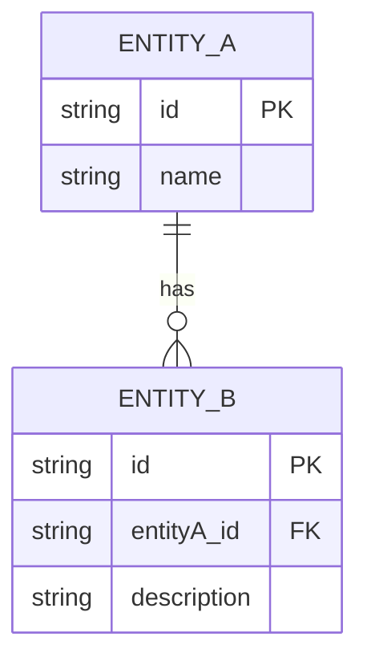
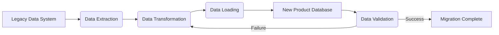

# Data Requirements Document

## 1. Data Sources and Collection Methods

[Identify all internal and external data sources for the system. Describe how data will be collected, ingested, or generated (e.g., manual entry, API integrations, batch imports, streaming data).]

## 2. Data Models and Schema Design

[Provide a high-level overview of the data models (conceptual, logical, physical). Describe the key entities, their attributes, and relationships. Reference detailed schema designs or ERDs.]

## 3. Data Quality Requirements

[Define the standards for data accuracy, completeness, consistency, timeliness, and validity. Outline procedures for data validation, cleansing, and error handling.]

## 4. Data Governance and Security

[Describe policies and procedures for data ownership, access control, privacy (e.g., PII handling), and compliance with data protection regulations. Detail encryption, masking, and auditing requirements.]

## 5. Data Migration and Integration Plans

[If applicable, outline the strategy for migrating data from legacy systems to the new system. Describe data transformation rules, migration tools, and validation processes. Detail plans for ongoing data integration with other systems.]

## 6. Backup and Recovery Procedures

[Specify the backup frequency, retention policies, and storage locations for all critical data. Detail the procedures for data recovery in case of data loss or system failure, including RTO (Recovery Time Objective) and RPO (Recovery Point Objective).]

## 7. Data Retention and Archiving Policies

[Define how long different types of data will be retained in the active system and when they will be archived or purged. Specify the criteria and procedures for data archiving and deletion.]
