# Architecture Decisions
## Claude MCP Servers Configuration

## Document Control
| Field | Value |
|-------|-------|
| Document Version | 1.0 |
| Last Updated | July 2025 |
| Status | **ACTIVE** |
| Document Owner | Technical Architecture Team |
| Audience | Developers, Technical Leads, DevOps |

---

## 1. Overview

This document captures key architectural decisions made during the development of the Claude MCP Server Toolkit. Each decision is documented with context, options considered, decision rationale, and consequences.

### 1.1. Decision Record Format

Each architectural decision follows this structure:
- **Decision ID**: Unique identifier
- **Date**: When the decision was made
- **Status**: Proposed, Accepted, Superseded, Deprecated
- **Context**: The situation prompting this decision
- **Options Considered**: Alternative approaches evaluated
- **Decision**: The chosen approach
- **Rationale**: Why this approach was selected
- **Consequences**: Positive and negative outcomes

---

## 2. Core Architecture Decisions

### 2.1. ADR-001: Multi-Platform Configuration Strategy

**Date**: July 2025  
**Status**: Accepted  
**Decision Owner**: Technical Lead

#### Context
The toolkit needs to support multiple AI platforms (Claude Desktop, Claude Code, VS Code/Cline) that each have different configuration formats and file locations.

#### Options Considered

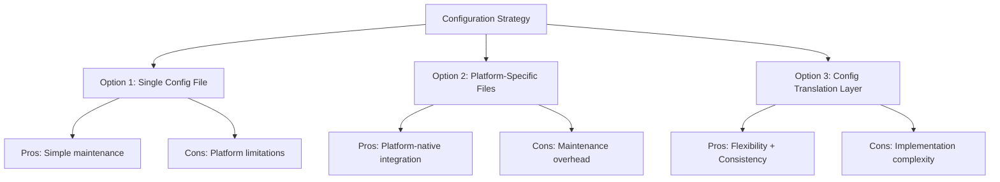

1. **Single Configuration File**: One JSON file for all platforms
2. **Platform-Specific Files**: Separate configurations for each platform
3. **Configuration Translation Layer**: Central config with platform translators

#### Decision
**Chosen**: Platform-Specific Files (Option 2)

#### Rationale
- **Native Integration**: Each platform works with its expected configuration format
- **Reduced Complexity**: No translation layer to maintain
- **Platform Optimization**: Can leverage platform-specific features
- **Debugging Simplicity**: Issues are isolated to specific platforms
- **User Familiarity**: Users work with standard platform configurations

#### Consequences
**Positive:**
- Better platform integration and performance
- Easier troubleshooting and debugging
- Platform-specific optimizations possible
- Standard configuration patterns

**Negative:**
- Configuration duplication across platforms
- Need to maintain multiple config examples
- Potential inconsistencies between platforms

---

### 2.2. ADR-002: Docker-First MCP Server Strategy

**Date**: July 2025  
**Status**: Accepted  
**Decision Owner**: Technical Lead

#### Context
With comprehensive Docker support now available for most MCP servers, we can adopt a Docker-first strategy that provides better isolation, security, and consistency across deployments.

#### Server Implementation Analysis

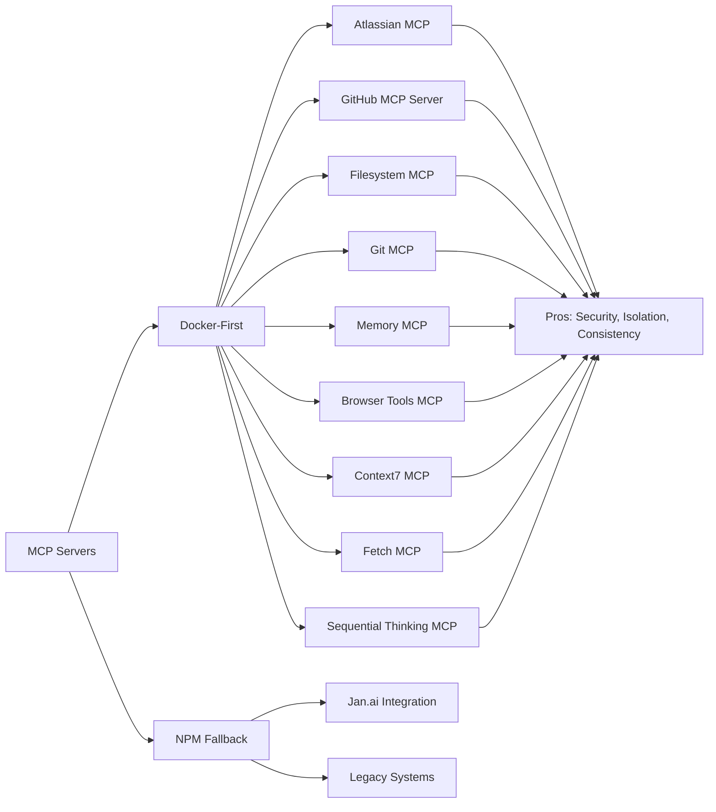

#### Options Considered
1. **Docker-Only**: Containerize all MCP servers with no fallbacks
2. **NPM-Only**: Use only Node.js based servers  
3. **Docker-First with NPM Fallback**: Prefer Docker, use NPM only when necessary

#### Decision
**Chosen**: Docker-First with NPM Fallback (Option 3)

#### Rationale
- **Security Isolation**: Docker provides better security boundaries between MCP servers
- **Consistency**: Same deployment pattern across most servers reduces complexity
- **Resource Control**: Better CPU/memory limits and monitoring capabilities
- **Dependency Management**: Eliminates Node.js version conflicts
- **Jan.ai Compatibility**: NPM fallback specifically for Jan.ai integration requirements

#### Implementation Strategy
| Server | Deployment | Docker Command | Reason |
|--------|------------|----------------|---------|
| Atlassian MCP | Docker | `docker run --rm -e CONFLUENCE_URL=... mcp/atlassian` | Security isolation, credential management |
| GitHub MCP | Docker | `docker run -i --rm -e GITHUB_PERSONAL_ACCESS_TOKEN ghcr.io/github/github-mcp-server` | Security isolation, official container |
| Filesystem MCP | Docker | `docker run --rm -v /path:/mnt mcp/server-filesystem` | File system access control |
| Git MCP | Docker | `docker run --rm -v /repo:/repo mcp/server/git` | Repository access control |
| Memory MCP | Docker | `docker run --rm -i mcp/server-memory` | Data persistence, resource control |
| Browser Tools MCP | Docker | `docker run --rm -i mcp/browser-tools-mcp` | Security isolation for web access |
| Context7 MCP | Docker | `docker build -t context7-mcp .` | Custom build, isolation |
| Fetch MCP | Docker | `docker run --rm -i zcaceres/fetch-mcp` | Network isolation |
| Sequential Thinking MCP | Docker | `docker build -t mcp/sequentialthinking` | Custom build, resource isolation |
| Jan.ai Integration | NPM | `npx jan-mcp-server` | Jan.ai specific requirements |

#### Consequences
**Positive:**
- Enhanced security through consistent isolation
- Simplified deployment and maintenance procedures
- Better resource monitoring and control
- Reduced dependency conflicts
- Standardized troubleshooting approach

**Negative:**
- Requires Docker installation and management
- Slightly higher resource overhead
- Custom build requirements for some servers
- Learning curve for Docker-based workflows

---

### 2.3. ADR-003: Connection Protocol and Transport

**Date**: July 2025  
**Status**: Accepted  
**Decision Owner**: Technical Lead

#### Context
MCP servers can communicate via different transports: stdio, HTTP, WebSockets. Platform compatibility varies.

#### Transport Compatibility Matrix

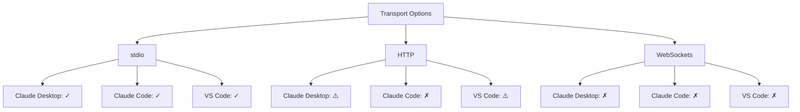

#### Options Considered
1. **stdio-only**: Use standard input/output for all connections
2. **HTTP for remote**: HTTP for distributed servers, stdio for local
3. **Mixed transports**: Different transports per platform capability

#### Decision
**Chosen**: stdio-only (Option 1)

#### Rationale
- **Universal Compatibility**: All target platforms support stdio
- **Simplicity**: Single transport protocol to implement and debug
- **Security**: No network exposure or port management
- **Performance**: Direct process communication
- **Standard Compliance**: Aligns with MCP specification recommendations

#### Implementation Details
```bash
# Docker stdio connection
docker run -i --rm server-image stdio

# NPM stdio connection  
npx server-package stdio

# Script-based stdio connection
bash connector-script.sh stdio
```

#### Consequences
**Positive:**
- Universal platform compatibility
- No network configuration required
- Better security (no open ports)
- Simplified debugging and logging

**Negative:**
- Limited to local server deployment
- Cannot easily scale across multiple machines
- Process management complexity

---

### 2.4. ADR-004: Error Handling and Resilience Strategy

**Date**: July 2025  
**Status**: Accepted  
**Decision Owner**: Technical Lead

#### Context
MCP servers can fail in various ways: container crashes, network issues, configuration errors. The system needs robust error handling.

#### Error Handling Architecture

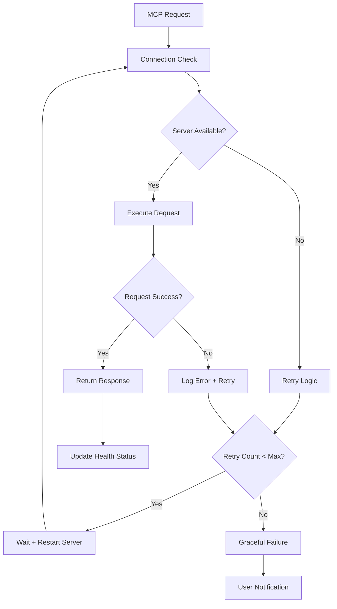

#### Options Considered
1. **Fail Fast**: Immediate failure on any error
2. **Auto-Recovery**: Automatic restart and retry logic
3. **Graceful Degradation**: Continue with reduced functionality

#### Decision
**Chosen**: Auto-Recovery with Graceful Degradation (Hybrid of 2 & 3)

#### Rationale
- **User Experience**: Minimize interruption to user workflows
- **Reliability**: Automatic recovery from transient issues
- **Debugging**: Comprehensive error logging and health monitoring
- **Flexibility**: Configurable retry policies per server type

#### Implementation Strategy
```bash
# Connector script error handling
exec_with_retry() {
    local max_retries=3
    local retry_delay=2
    
    for i in $(seq 1 $max_retries); do
        if result=$(execute_command "$@" 2>&1); then
            echo "$result"
            return 0
        fi
        
        log_error "Attempt $i failed: $result"
        [ $i -lt $max_retries ] && sleep $retry_delay
    done
    
    log_error "All retry attempts failed"
    return 1
}
```

#### Consequences
**Positive:**
- Improved system reliability and uptime
- Better user experience with transparent recovery
- Comprehensive error tracking and diagnosis
- Reduced manual intervention requirements

**Negative:**
- Increased complexity in connector scripts
- Potential delays during recovery periods
- Resource overhead from retry mechanisms

---

### 2.5. ADR-005: Security and Credential Management

**Date**: July 2025  
**Status**: Accepted  
**Decision Owner**: Security Lead

#### Context
MCP servers require various credentials (GitHub tokens, API keys) that must be securely managed across platforms.

#### Security Architecture

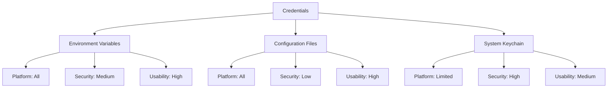

#### Options Considered
1. **Configuration Files**: Store credentials in JSON configuration files
2. **Environment Variables**: Use environment variables for all credentials
3. **System Keychain**: Integrate with OS credential management
4. **External Secrets**: Use external secret management services

#### Decision
**Chosen**: Environment Variables with Configuration File Fallback (Hybrid of 1 & 2)

#### Rationale
- **Platform Compatibility**: Works across all target operating systems
- **Security Balance**: Better than plaintext files, practical for local development
- **CI/CD Integration**: Environment variables work well in automation
- **User Control**: Users can choose their preferred credential management
- **Audit Trail**: Clear tracking of credential usage

#### Implementation Strategy
```bash
# Priority order for credential resolution:
1. Environment variables (GITHUB_PERSONAL_ACCESS_TOKEN)
2. .env file (for local development)
3. Configuration file env section (fallback)
4. Interactive prompt (if all else fails)
```

#### Security Controls
- Restrictive file permissions (600) on configuration files
- Environment variable validation and sanitization
- No credentials in version control (gitignore)
- Regular security audits via automated scripts

#### Consequences
**Positive:**
- Good security posture for local development
- Platform-agnostic credential management
- Flexible deployment options
- Clear security audit trail

**Negative:**
- Not enterprise-grade secret management
- Potential for credential exposure if misconfigured
- Manual credential rotation required

---

### 2.6. ADR-006: Logging and Monitoring Strategy

**Date**: July 2025  
**Status**: Accepted  
**Decision Owner**: Operations Lead

#### Context
The system needs comprehensive logging for debugging, monitoring, and compliance across multiple components and platforms.

#### Logging Architecture

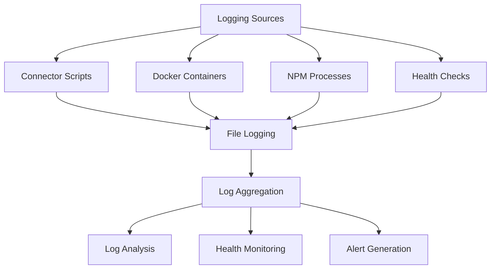

#### Options Considered
1. **Syslog Integration**: Use system logging facilities
2. **Centralized Logging**: ELK stack or similar
3. **File-Based Logging**: Simple file logging with rotation
4. **Cloud Logging**: External logging services

#### Decision
**Chosen**: File-Based Logging with Log Rotation (Option 3)

#### Rationale
- **Simplicity**: No external dependencies or complex setup
- **Local Development**: Perfect for local development environments
- **Portability**: Logs travel with the project
- **Performance**: Minimal overhead on system resources
- **Debugging**: Easy access to logs for troubleshooting

#### Log Structure
```
logs/
├── startup.log          # Service initialization
├── health.log           # Health check results  
├── maintenance.log      # Maintenance operations
├── security-audit.log   # Security audit results
└── error.log           # Error and exception logs
```

#### Log Format Standard
```bash
# Timestamp | Level | Component | Message
2025-07-05T21:15:30Z | INFO | github-connector | Server started successfully
2025-07-05T21:15:35Z | ERROR | memory-bank | Container failed to start: port conflict
```

#### Consequences
**Positive:**
- Simple implementation and maintenance
- No external dependencies
- Easy debugging and troubleshooting
- Predictable performance characteristics

**Negative:**
- Limited scalability for large deployments
- No real-time monitoring capabilities
- Manual log analysis required
- Local storage limitations

---

## 3. Integration Decisions

### 3.1. ADR-007: VS Code Integration Approach

**Date**: July 2025  
**Status**: Accepted  
**Decision Owner**: Developer Experience Lead

#### Context
VS Code integration requires automatic startup of MCP servers when the editor opens, while preventing duplicate processes.

#### Integration Strategy

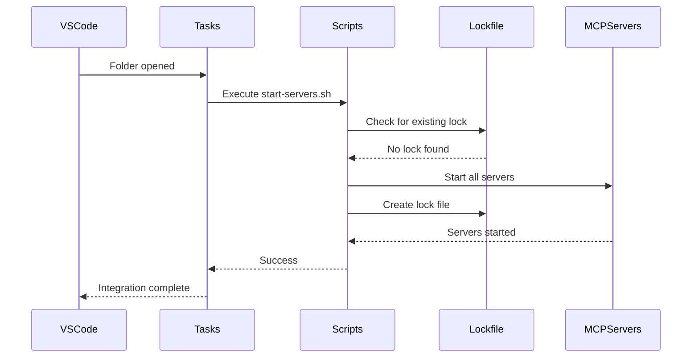

#### Options Considered
1. **VS Code Extensions**: Custom extension for MCP management
2. **Task Integration**: Use VS Code tasks.json for automation
3. **Workspace Configuration**: Project-specific setup files
4. **Manual Startup**: User-initiated MCP server startup

#### Decision
**Chosen**: Task Integration with Lockfile Management (Option 2)

#### Rationale
- **No Extension Dependency**: Works with standard VS Code installation
- **Automatic Startup**: Servers start when project opens
- **Process Safety**: Lockfile prevents duplicate server instances
- **User Control**: Easy to disable or modify via tasks configuration
- **Standard Integration**: Uses VS Code's built-in task system

#### Implementation Details
```json
{
  "version": "2.0.0",
  "tasks": [
    {
      "label": "Start MCP Servers",
      "type": "shell",
      "command": "bash ${workspaceFolder}/vscode-integration/start-servers.sh",
      "isBackground": true,
      "runOptions": {
        "runOn": "folderOpen"
      }
    }
  ]
}
```

#### Consequences
**Positive:**
- Seamless user experience with automatic startup
- No additional software dependencies
- Standard VS Code integration patterns
- Easy to troubleshoot and modify

**Negative:**
- Limited to VS Code environments
- Requires project-specific configuration
- Manual cleanup needed if VS Code crashes

---

### 3.2. ADR-008: Memory Bank Data Persistence

**Date**: July 2025  
**Status**: Accepted  
**Decision Owner**: Data Architecture Lead

#### Context
The Memory Bank MCP server needs persistent storage that survives container restarts while remaining portable across environments.

#### Data Persistence Options

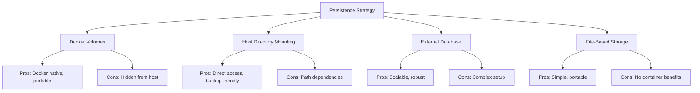

#### Options Considered
1. **Named Docker Volumes**: Use Docker's volume management
2. **Host Directory Mounting**: Mount local directories into containers
3. **External Database**: PostgreSQL or MongoDB for persistence
4. **Embedded Database**: SQLite with host directory mounting

#### Decision
**Chosen**: Host Directory Mounting with Embedded Database (Hybrid of 2 & 4)

#### Rationale
- **User Access**: Users can directly access their memory bank data
- **Backup Simplicity**: Easy to backup and restore data files
- **Portability**: Data travels with the project directory
- **Performance**: Local file system performance
- **Transparency**: Clear understanding of where data is stored

#### Implementation Strategy
```bash
# Memory bank data structure
data/
├── memory-bank/
│   ├── memories.db      # SQLite database
│   ├── embeddings/      # Vector embeddings cache
│   └── exports/         # Export files

# Docker mounting
docker run -i --rm \
  -v "$(pwd)/data/memory-bank:/app/data" \
  memory-bank-mcp:local
```

#### Consequences
**Positive:**
- Direct user access to data files
- Simple backup and restore procedures
- No hidden Docker volume management
- Clear data ownership and location

**Negative:**
- Path dependency issues across environments
- Potential permission conflicts
- Manual data directory management

---

## 4. Technology Selection Decisions

### 4.1. ADR-009: Scripting Language Choice

**Date**: July 2025  
**Status**: Accepted  
**Decision Owner**: Developer Experience Lead

#### Context
The toolkit requires shell scripts for automation, health checks, and connector functions. Multiple scripting options are available.

#### Language Comparison

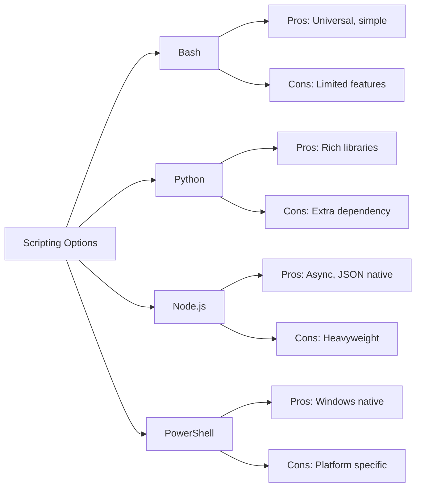

#### Options Considered
1. **Bash Shell Scripts**: Standard Unix shell scripting
2. **Python Scripts**: Python for complex logic and JSON handling
3. **Node.js Scripts**: JavaScript for MCP protocol handling
4. **Cross-Platform Scripts**: PowerShell Core for Windows compatibility

#### Decision
**Chosen**: Bash Shell Scripts (Option 1)

#### Rationale
- **Universal Availability**: Present on all target Unix-like systems
- **Simplicity**: Matches the toolkit's utility nature
- **Docker Integration**: Excellent for container management
- **Process Management**: Native process control capabilities
- **Learning Curve**: Familiar to most developers and ops teams

#### Implementation Standards
```bash
#!/bin/bash
set -euo pipefail  # Strict error handling

# Standard script structure:
# 1. Shebang and error handling
# 2. Function definitions
# 3. Variable declarations
# 4. Main logic
# 5. Cleanup and exit
```

#### Consequences
**Positive:**
- No additional language dependencies
- Excellent Docker and process integration
- Fast execution and minimal overhead
- Standard Unix tooling compatibility

**Negative:**
- Limited Windows compatibility (requires WSL/Git Bash)
- Complex JSON manipulation requires external tools
- Error handling can be verbose

---

### 4.2. ADR-010: Health Check Implementation

**Date**: July 2025  
**Status**: Accepted  
**Decision Owner**: Operations Lead

#### Context
System health monitoring needs to check multiple components: Docker containers, NPM processes, network connectivity, and configuration validity.

#### Health Check Architecture

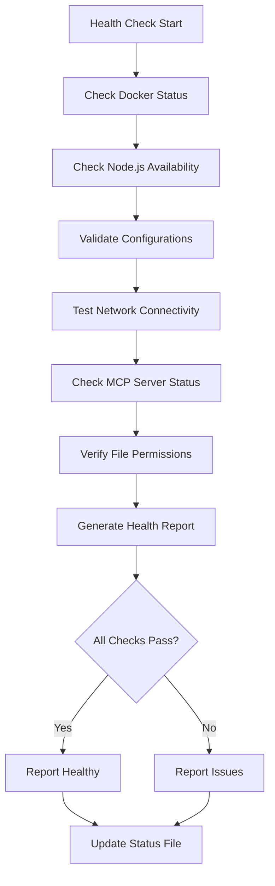

#### Options Considered
1. **Simple Binary Check**: Pass/fail health status only
2. **Component-Level Reporting**: Individual component health status
3. **Detailed Diagnostics**: Comprehensive health report with recommendations
4. **External Health Monitoring**: Integration with monitoring systems

#### Decision
**Chosen**: Component-Level Reporting with Diagnostics (Hybrid of 2 & 3)

#### Rationale
- **Actionable Information**: Users get specific information about issues
- **Debugging Support**: Detailed output helps with troubleshooting
- **Automation Friendly**: Machine-readable status for scripts
- **Progressive Disclosure**: Summary status with detailed breakdown available

#### Implementation Example
```bash
# Health check output format
✓ Docker is running (version 24.0.2)
✓ Node.js is available (version 18.16.0)
✓ GitHub MCP server container is running (ID: abc123)
✗ Memory Bank image is missing - run: bash scripts/build-memory-bank.sh
✓ Configuration files are valid
⚠ Network latency is high (500ms to github.com)

Overall Status: DEGRADED (5/6 checks passed)
```

#### Consequences
**Positive:**
- Clear actionable feedback for users
- Detailed diagnostic information
- Supports both manual and automated monitoring
- Progressive complexity (summary + details)

**Negative:**
- More complex implementation
- Potential information overload
- Requires maintenance as system evolves

### 4.3. ADR-011: Docker Image Lifecycle Management

**Date**: July 2025  
**Status**: Accepted  
**Decision Owner**: DevOps Lead

#### Context
With Docker-first strategy, we need clear policies for managing Docker images including pre-built vs custom images, update strategies, and local vs registry management.

#### Image Management Strategy

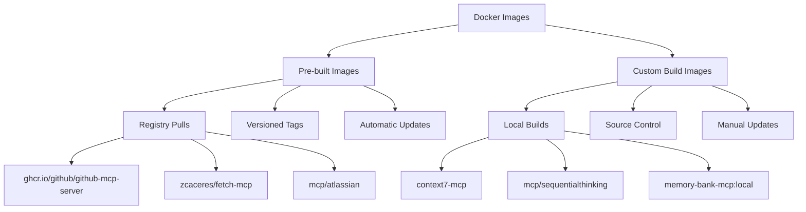

#### Options Considered
1. **Registry-Only**: Use only pre-built images from public registries
2. **Build-Only**: Build all images locally from source
3. **Hybrid Management**: Mix of registry pulls and local builds based on availability

#### Decision
**Chosen**: Hybrid Management (Option 3)

#### Rationale
- **Leverage Existing Images**: Use official pre-built images when available for stability
- **Custom Builds When Needed**: Build locally for servers without official containers
- **Security Control**: Source-based builds for sensitive environments
- **Performance Optimization**: Registry images for faster deployment, local builds for customization

#### Implementation Strategy

**Pre-built Images (Registry Pull):**
```bash
# Official images - pull directly
docker pull ghcr.io/github/github-mcp-server
docker pull zcaceres/fetch-mcp
docker pull mcp/atlassian
docker pull mcp/server-filesystem
docker pull mcp/server/git
docker pull mcp/server-memory
docker pull mcp/browser-tools-mcp
```

**Custom Build Images (Local Build):**
```bash
# Context7 MCP - requires custom build
git clone https://github.com/upstash/context7-mcp.git
cd context7-mcp
docker build -t context7-mcp .

# Sequential Thinking MCP - custom build
git clone https://github.com/modelcontextprotocol/servers.git
cd servers
docker build -t mcp/sequentialthinking -f src/sequentialthinking/Dockerfile .

# Memory Bank MCP - local custom build
bash scripts/build-memory-bank.sh
```

#### Update Procedures

**Registry Images:**
- Check for updates weekly: `docker pull <image>`
- Pin to specific versions for stability
- Test updates in development environment first

**Custom Build Images:**
- Monitor source repositories for updates
- Rebuild after source changes
- Version tag local builds: `image:YYYY-MM-DD`

#### Security Considerations
- **Image Scanning**: Use `docker scout cves` for vulnerability scanning
- **Trusted Sources**: Only pull from verified registries
- **Build Reproducibility**: Use Dockerfile pinning for consistent builds
- **Regular Updates**: Establish update cadence for security patches

#### Storage Management
```bash
# Clean up old images
docker image prune -f

# Remove specific old versions
docker rmi image:old-tag

# Monitor disk usage
docker system df
```

#### Consequences
**Positive:**
- Clear update and management procedures
- Balance between convenience and security
- Optimized for different use cases
- Standardized image lifecycle

**Negative:**
- Mixed management complexity
- Different procedures for different image types
- Requires monitoring of multiple sources
- Storage overhead for multiple image versions

---

## 5. Decision Impact Analysis

### 5.1. Decision Dependencies

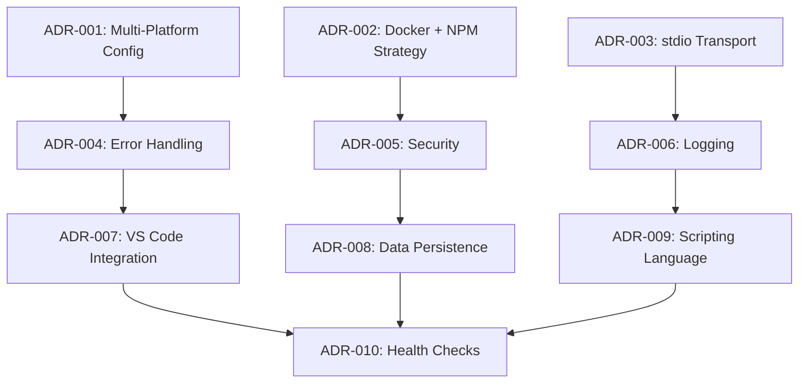

### 5.2. Future Considerations

#### Potential Architecture Evolution
1. **HTTP Transport Support**: If platforms add HTTP transport support
2. **Configuration Translation Layer**: If maintaining multiple configs becomes burdensome
3. **External Secret Management**: For enterprise deployments
4. **Distributed Deployment**: For team-shared MCP servers

#### Migration Strategies
- **Backward Compatibility**: All decisions include migration paths
- **Feature Flags**: New features can be enabled gradually
- **Configuration Versioning**: Support for multiple configuration formats
- **Deprecation Process**: Clear timeline for retiring old approaches

---

This architecture decisions document captures the key technical choices that shape the Claude MCP Server Toolkit, providing context and rationale for future development and maintenance decisions.
