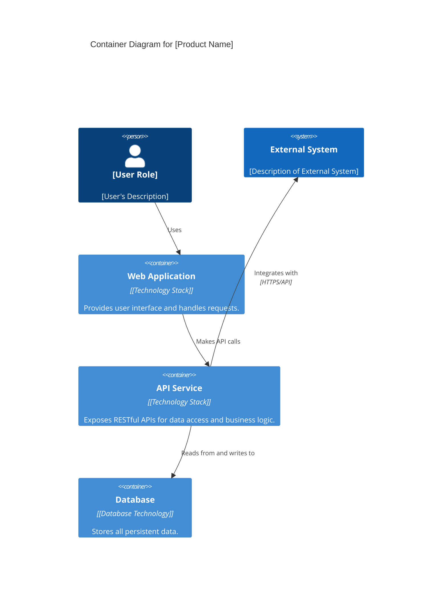
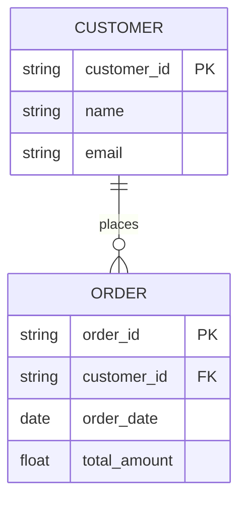
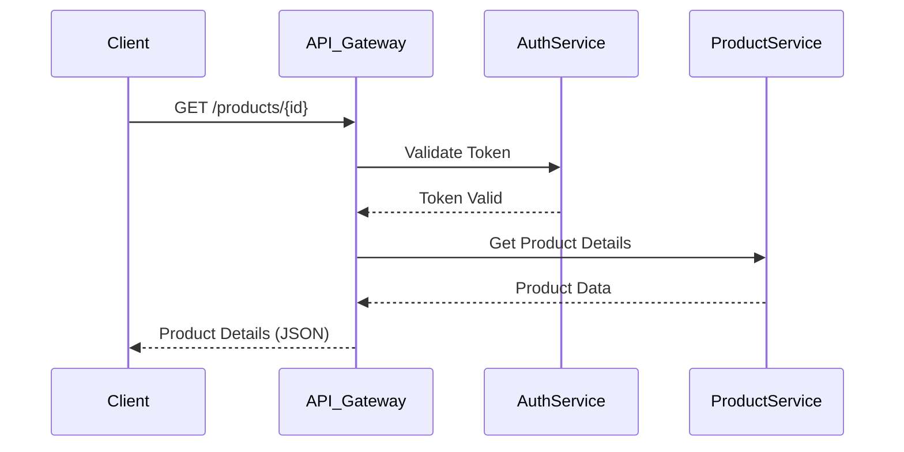

# Technical Design Document

## 1. System Architecture Diagrams

[Provide detailed diagrams illustrating the system's architecture. Describe each component, its responsibilities, and how components interact. Include logical, physical, and deployment views as appropriate.]

### 1.1. Logical Architecture



### 1.2. Deployment Architecture

```mermaid
C4Deployment
    title Deployment Diagram for [Product Name]
    DeploymentNode(web_server, "Web Server", "[Server Type]") {
        Container(web_app, "Web Application", "[Technology Stack]")
    }
    DeploymentNode(app_server, "Application Server", "[Server Type]") {
        Container(api_service, "API Service", "[Technology Stack]")
    }
    DeploymentNode(db_server, "Database Server", "[Server Type]") {
        Container(database, "Database", "[Database Technology]")
    }

    Rel(web_server, app_server, "Communicates with", "HTTPS")
    Rel(app_server, db_server, "Connects to", "Database Protocol")
```

## 2. Database Design and ERD Descriptions

[Provide detailed database schema designs. Describe tables, columns, data types, relationships, and indexing strategies. Reference the ERD from `07-data-requirements.md` and provide more granular details here.]



## 3. API Specifications and Documentation

[Document all internal and external APIs. For each API, include endpoints, methods, request/response formats, authentication mechanisms, and error codes. Consider using OpenAPI/Swagger specifications.]



## 4. Security Implementation Details

[Detail the implementation of security features, including authentication flows, authorization rules, data encryption at rest and in transit, vulnerability management, and security auditing mechanisms.]

## 5. Error Handling and Logging

[Describe the strategy for error handling across the system, including error types, custom error messages, and how errors are propagated. Detail the logging strategy, including log levels, log formats, storage, and monitoring.]

## 6. Performance Optimization Strategies

[Outline specific techniques and approaches to ensure the system meets performance requirements, such as caching strategies, database query optimizations, load balancing, and code efficiency improvements.]

## 7. Code Standards and Conventions

[Specify the coding guidelines, naming conventions, and best practices that development teams must follow to ensure code quality, maintainability, and consistency.]
