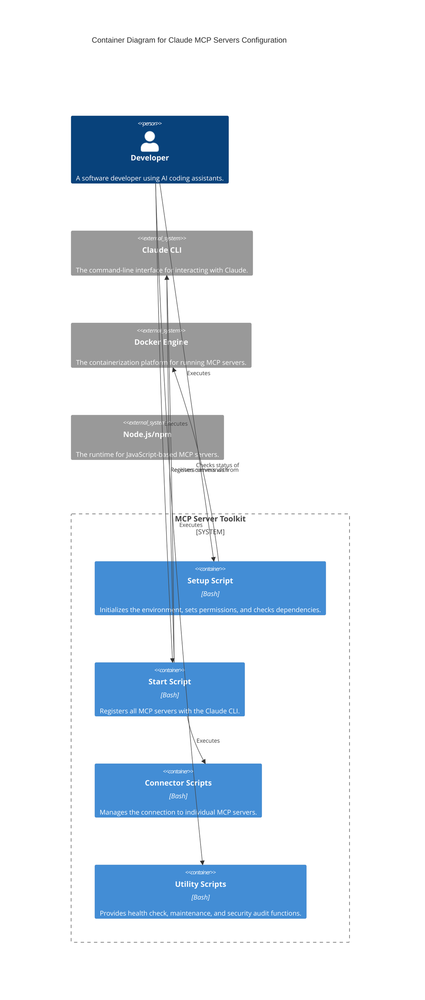

# Technical Design Document

## 1. System Architecture Diagrams

### 1.1. Logical Architecture

## 2. Database Design and ERD Descriptions

This is not applicable, as the Claude MCP Servers Configuration toolkit is stateless and does not have its own database.

## 3. API Specifications and Documentation

The toolkit does not expose any APIs. It is a collection of command-line scripts that interact with the `claude` CLI and the Docker daemon.

## 4. Security Implementation Details

*   **Secrets Management**: The `GITHUB_PERSONAL_ACCESS_TOKEN` and other sensitive data are stored in a `.env` file. This file is listed in `.gitignore` to prevent it from being committed to version control.
*   **Secure Permissions**: The `setup.sh` script sets file permissions to `600` on the `config/config.sh` file, which is sourced by other scripts to load the environment variables.
*   **Security Audit**: The `scripts/security-audit.sh` script checks for potential security issues, such as exposed tokens in the environment and loose permissions on configuration files.

## 5. Error Handling and Logging

*   **Error Handling**: The scripts are designed to fail fast. If a command fails, the script will typically print an error message to `stderr` and exit with a non-zero status code.
*   **Logging**: The `vscode-integration/start-servers.sh` script logs its startup activities to `logs/startup.log`. Other scripts print their output to `stdout` and `stderr`.

## 6. Performance Optimization Strategies

The scripts are designed to be lightweight and efficient. They have minimal performance overhead, and the overall performance is determined by the speed of the underlying commands they execute (e.g., `docker`, `claude`, `npm`).

## 7. Code Standards and Conventions

*   **Coding Style**: All shell scripts adhere to the Google Shell Style Guide.
*   **Testing**: The project includes a comprehensive test suite in the `tests/` directory. The tests are written in Bash and use a custom assertion library. All tests must pass before changes are merged into the main branch.
*   **Linting**: While not currently implemented, a future enhancement could include the use of a shell linter like ShellCheck to enforce code quality.
