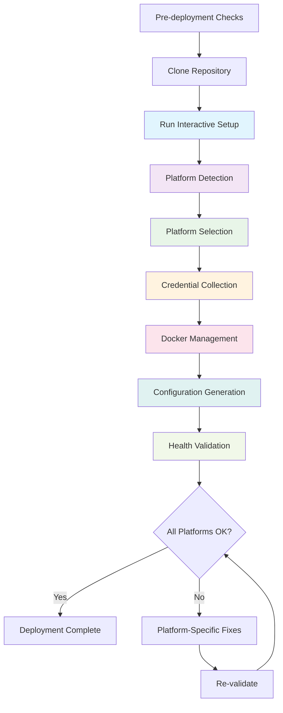
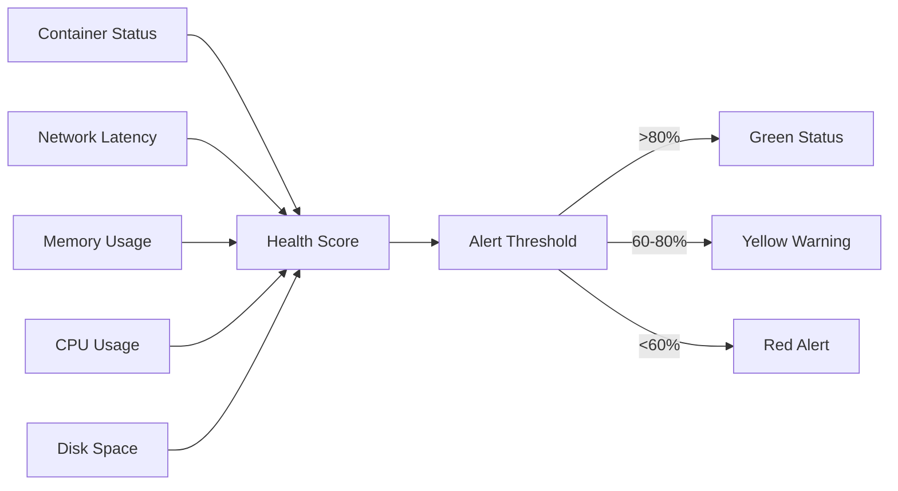
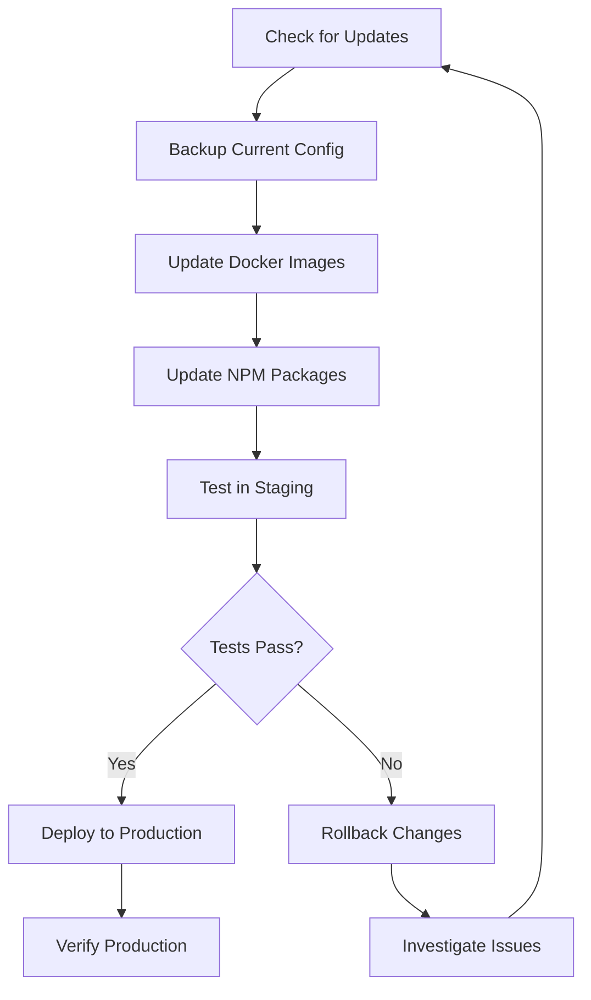
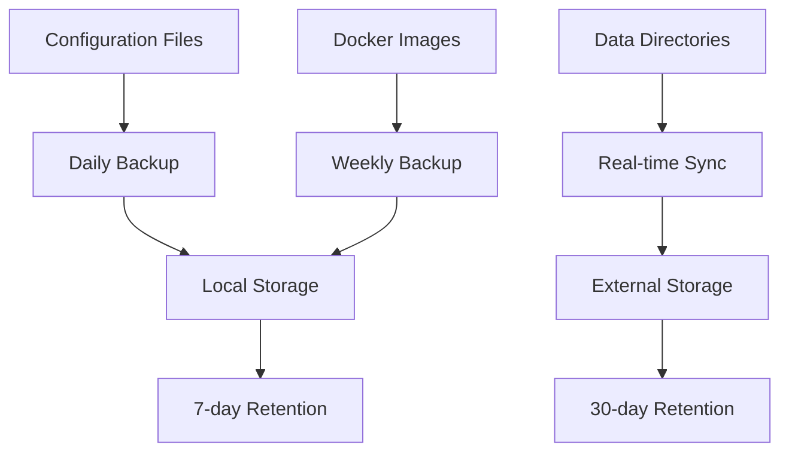
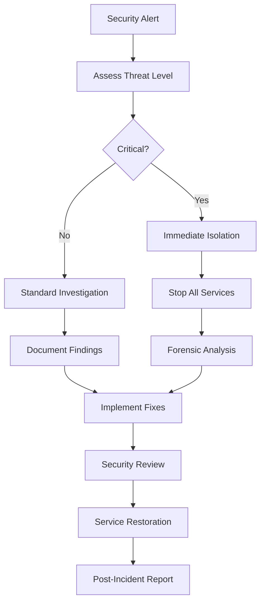
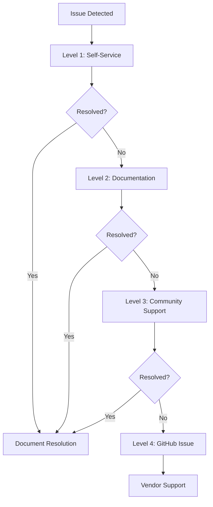
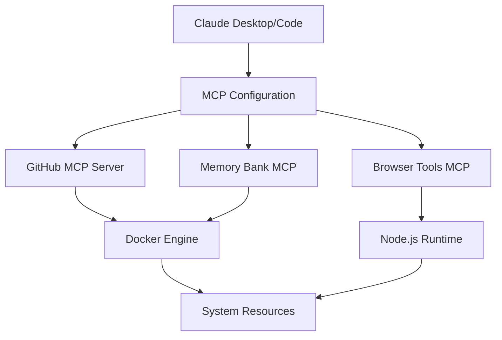

# Operations Guide
## Multi-Platform AI Assistant Configuration

## Document Control
| Field | Value |
|-------|-------|
| Document Version | 2.0 |
| Last Updated | January 2025 |
| Status | **ACTIVE** |
| Document Owner | Operations Team |
| Audience | DevOps, System Administrators, Developers |

---

## 1. Deployment Procedures

### 1.1. Enterprise Deployment Strategy

#### Pre-Deployment Checklist
- [ ] Docker Desktop installed and running (version 20.10.0+)
- [ ] Node.js 16+ installed
- [ ] Git access configured
- [ ] AI platforms installed:
  - [ ] Claude Desktop
  - [ ] Claude Code (VS Code extension)  
  - [ ] VS Code with Cline extension
  - [ ] Gemini CLI (if required)
  - [ ] Jan.ai (if required)
- [ ] Required tokens and credentials available:
  - [ ] GitHub Personal Access Token
  - [ ] Atlassian API tokens (if required)
  - [ ] Gemini API key (if required)
  - [ ] Jan.ai API credentials (if required)
- [ ] Network access to Docker registries and NPM
- [ ] Administrative privileges for configuration file creation

#### Enhanced Deployment Workflow



#### Automated Deployment Process

```bash
# 1. Clone repository
git clone https://github.com/aporb/claude-mcp-server-toolkit.git
cd claude-mcp-server-toolkit

# 2. Run interactive setup wizard
bash setup.sh

# 3. Advanced deployment options
bash setup.sh --help                    # Show all options
bash setup.sh --dry-run                 # Preview changes
bash setup.sh --quiet --auto-build      # Automated deployment
bash setup.sh --verbose                 # Debug deployment
```

#### Manual Platform Configuration

For environments requiring manual control:

```bash
# Platform detection and selection
bash scripts/platform-detector.sh select

# Configure individual platforms
bash scripts/configure-claude-desktop.sh
bash scripts/configure-claude-code.sh
bash scripts/configure-vscode-cline.sh

# Validation
bash scripts/health-check.sh
```

### 1.2. Platform-Specific Deployment

#### Claude Desktop Deployment
```bash
# Create configuration directory
mkdir -p ~/.config/claude

# Deploy configuration
cat > ~/.config/claude/claude_desktop_config.json << 'EOF'
{
  "mcpServers": {
    "github": {
      "command": "docker",
      "args": ["run", "-i", "--rm", "-e", "GITHUB_PERSONAL_ACCESS_TOKEN", "ghcr.io/github/github-mcp-server"]
    },
    "context7": {
      "command": "npx",
      "args": ["-y", "@upstash/context7-mcp@latest"]
    },
    "browser-tools": {
      "command": "npx", 
      "args": ["-y", "@agentdeskai/browser-tools-mcp@latest"]
    },
    "memory-bank": {
      "command": "bash",
      "args": ["$HOME/.claude/mcp-toolkit/scripts/memory-bank-connector.sh"]
    }
  }
}
EOF

# Set secure permissions
chmod 600 ~/.config/claude/claude_desktop_config.json
```

#### Claude Code Deployment
```bash
# Create configuration directory
mkdir -p ~/.config/claude-code

# Deploy configuration
cat > ~/.config/claude-code/mcp.json << 'EOF'
{
  "mcpServers": {
    "github": {
      "command": "docker",
      "args": ["run", "-i", "--rm", "-e", "GITHUB_PERSONAL_ACCESS_TOKEN", "ghcr.io/github/github-mcp-server"]
    },
    "filesystem": {
      "command": "npx",
      "args": ["-y", "@modelcontextprotocol/server-filesystem", "$HOME/Desktop", "$HOME/Downloads"]
    }
  }
}
EOF

# Set secure permissions
chmod 600 ~/.config/claude-code/mcp.json
```

---

## 2. Monitoring and Health Checks

### 2.1. Automated Health Monitoring

#### Health Check Script
The built-in health check script monitors all MCP server components:

```bash
# Run comprehensive health check
bash scripts/health-check.sh

# Expected output:
# ✓ Docker is running
# ✓ Node.js is available
# ✓ GitHub MCP server container is running
# ✓ Memory Bank image is available
# ✓ Configuration files are valid
# ✓ Network connectivity is good
```

#### Continuous Monitoring Setup

```bash
# Create monitoring cron job
(crontab -l 2>/dev/null; echo "*/5 * * * * $HOME/claude-mcp-server-toolkit/scripts/health-check.sh >> $HOME/claude-mcp-server-toolkit/logs/health.log 2>&1") | crontab -

# Monitor logs
tail -f logs/health.log
```

### 2.2. Key Performance Indicators

#### System Health Metrics



#### Monitoring Commands

```bash
# Docker container health
docker ps --format "table {{.Names}}\t{{.Status}}\t{{.Ports}}"

# System resource usage
docker stats --no-stream

# Disk space monitoring
df -h | grep -E "(Size|Available)"

# Memory usage
free -h

# Network connectivity
ping -c 3 github.com
ping -c 3 registry.npmjs.org
```

### 2.3. Log Management

#### Log File Structure
```
logs/
├── startup.log          # Service startup logs
├── health.log           # Health check results
├── maintenance.log      # Maintenance task logs
├── security-audit.log   # Security audit results
└── error.log           # Error and exception logs
```

#### Log Rotation Setup
```bash
# Create logrotate configuration
sudo cat > /etc/logrotate.d/claude-mcp << 'EOF'
$HOME/claude-mcp-server-toolkit/logs/*.log {
    daily
    rotate 7
    compress
    missingok
    notifempty
    create 644 $USER $USER
}
EOF
```

#### Log Analysis Commands
```bash
# View recent errors
tail -50 logs/error.log

# Search for specific issues
grep -i "failed\|error\|exception" logs/*.log

# Monitor logs in real-time
tail -f logs/startup.log logs/health.log

# Analyze log patterns
awk '/ERROR/ {print $1, $2, $5}' logs/*.log | sort | uniq -c
```

---

## 3. Maintenance Procedures

### 3.1. Routine Maintenance

#### Daily Tasks (Automated)
```bash
# Health check (via cron)
bash scripts/health-check.sh

# Log rotation (via logrotate)
# Automatic cleanup of old logs
```

#### Weekly Tasks
```bash
# Run maintenance script
bash scripts/maintenance.sh

# Security audit
bash scripts/security-audit.sh

# Update Docker images
docker pull ghcr.io/github/github-mcp-server

# Clean up unused Docker resources
docker system prune -f
```

#### Monthly Tasks
```bash
# Update NPM packages
npm update -g @upstash/context7-mcp@latest
npm update -g @agentdeskai/browser-tools-mcp@latest
npm update -g puppeteer-mcp-server

# Full system cleanup
bash scripts/cleanup.sh

# Backup configurations
tar -czf backups/mcp-config-$(date +%Y%m%d).tar.gz ~/.config/claude*
```

### 3.2. Update Procedures

#### MCP Server Updates



#### Update Commands
```bash
# 1. Backup current state
cp ~/.config/claude/claude_desktop_config.json ~/.config/claude/claude_desktop_config.json.backup

# 2. Update Docker images
docker pull ghcr.io/github/github-mcp-server
bash scripts/build-memory-bank.sh

# 3. Update NPM packages
npm update -g @upstash/context7-mcp@latest
npm update -g @agentdeskai/browser-tools-mcp@latest
npm update -g puppeteer-mcp-server

# 4. Restart services
# Claude Desktop: Restart application
# Claude Code: No restart needed
# VS Code: Reload window

# 5. Verify functionality
bash scripts/health-check.sh
```

### 3.3. Backup and Recovery

#### Backup Strategy



#### Backup Commands
```bash
# Create backup directory
mkdir -p backups

# Configuration backup
tar -czf backups/config-$(date +%Y%m%d-%H%M).tar.gz \
  ~/.config/claude* \
  .env \
  scripts/

# Data backup
tar -czf backups/data-$(date +%Y%m%d-%H%M).tar.gz \
  data/ \
  logs/

# Docker image backup
docker save ghcr.io/github/github-mcp-server | gzip > backups/github-mcp-$(date +%Y%m%d).tar.gz
docker save memory-bank-mcp:local | gzip > backups/memory-bank-mcp-$(date +%Y%m%d).tar.gz
```

#### Recovery Procedures
```bash
# Restore configurations
tar -xzf backups/config-YYYYMMDD-HHMM.tar.gz -C /

# Restore data
tar -xzf backups/data-YYYYMMDD-HHMM.tar.gz

# Restore Docker images
docker load < backups/github-mcp-YYYYMMDD.tar.gz
docker load < backups/memory-bank-mcp-YYYYMMDD.tar.gz

# Verify restoration
bash scripts/health-check.sh
```

---

## 4. Security Operations

### 4.1. Security Monitoring

#### Security Audit Checklist
- [ ] File permissions on configuration files
- [ ] Environment variable security
- [ ] Docker container security
- [ ] Network access controls
- [ ] Token rotation status
- [ ] Exposed secrets detection

#### Automated Security Checks
```bash
# Run security audit
bash scripts/security-audit.sh

# Check file permissions
find ~/.config/claude* -type f -exec ls -la {} \;

# Scan for exposed secrets
grep -r "token\|key\|password" ~/.config/claude* || echo "No secrets found in configs"

# Docker security scan
docker scout cves ghcr.io/github/github-mcp-server
```

### 4.2. Access Control

#### User Access Management
```bash
# Set restrictive permissions on sensitive files
chmod 600 ~/.config/claude/claude_desktop_config.json
chmod 600 ~/.config/claude-code/mcp.json
chmod 600 .env

# Verify permissions
ls -la ~/.config/claude*
ls -la .env
```

#### Token Management
```bash
# Rotate GitHub token
# 1. Generate new token in GitHub settings
# 2. Update .env file
# 3. Restart Docker containers
docker restart $(docker ps -q --filter ancestor=ghcr.io/github/github-mcp-server)
```

### 4.3. Incident Response

#### Security Incident Workflow



#### Incident Response Commands
```bash
# Emergency shutdown
bash scripts/cleanup.sh
docker stop $(docker ps -q)

# Isolate configuration
mv ~/.config/claude ~/.config/claude.quarantine

# Collect forensic data
cp logs/*.log incident-logs/
docker logs $(docker ps -aq) > incident-logs/docker.log

# Reset to clean state
git checkout HEAD -- .
bash setup.sh
```

---

## 5. Performance Optimization

### 5.1. Resource Optimization

#### Container Resource Limits
```bash
# Monitor container resource usage
docker stats --no-stream

# Set resource limits for GitHub MCP container
docker run -i --rm \
  --memory=512m \
  --cpus=1.0 \
  -e GITHUB_PERSONAL_ACCESS_TOKEN \
  ghcr.io/github/github-mcp-server
```

#### System Optimization
```bash
# Clean up Docker system
docker system prune -f

# Remove unused images
docker image prune -f

# Clean npm cache
npm cache clean --force

# Monitor disk usage
du -sh ~/.config/claude*
du -sh data/
```

### 5.2. Performance Tuning

#### Network Optimization
```bash
# Test network latency
ping -c 10 github.com
ping -c 10 registry.npmjs.org

# Configure DNS for faster resolution
echo "nameserver 1.1.1.1" | sudo tee -a /etc/resolv.conf
```

#### Memory Management
```bash
# Monitor memory usage
free -h
ps aux | grep -E "(docker|node|claude)"

# Clean up memory if needed
echo 3 | sudo tee /proc/sys/vm/drop_caches
```

---

## 6. Troubleshooting Operations

### 6.1. Common Operational Issues

| Issue | Symptoms | Resolution | Prevention |
|-------|----------|------------|------------|
| **Container Won't Start** | Docker errors, missing containers | Check Docker daemon, rebuild images | Regular image updates |
| **High Memory Usage** | System slowdown, OOM errors | Restart containers, increase limits | Memory monitoring |
| **Configuration Corruption** | MCP servers not loading | Restore from backup | Regular backups |
| **Network Connectivity** | Timeouts, failed connections | Check network, restart services | Network monitoring |
| **Permission Denied** | Access errors, script failures | Fix file permissions | Permission audits |

### 6.2. Diagnostic Procedures

#### System Diagnostics
```bash
# Comprehensive system check
bash scripts/health-check.sh

# Docker diagnostics
docker system info
docker system events --since 1h

# Network diagnostics
netstat -tuln | grep -E "(2376|3000|8080)"
ss -tuln | grep docker

# Process diagnostics
ps aux | grep -E "(docker|claude|node)"
pstree -p $(pgrep dockerd)
```

#### Log Analysis
```bash
# Error pattern analysis
grep -E "ERROR|FATAL|CRITICAL" logs/*.log | tail -20

# Performance issue detection
grep -E "timeout|slow|latency" logs/*.log

# Security event detection
grep -E "failed|denied|unauthorized" logs/*.log
```

### 6.3. Escalation Procedures

#### Support Escalation Matrix



#### Escalation Contact Information
- **Level 1**: Self-service using this guide
- **Level 2**: Check TROUBLESHOOTING.md and User Guide
- **Level 3**: Community forums and Discord
- **Level 4**: GitHub Issues with full diagnostic data

---

## 7. Disaster Recovery

### 7.1. Recovery Scenarios

#### Complete System Failure
```bash
# 1. Assess damage
ls -la ~/.config/claude*
docker ps -a
docker images

# 2. Restore from backup
tar -xzf backups/config-latest.tar.gz -C /
tar -xzf backups/data-latest.tar.gz

# 3. Rebuild services
bash setup.sh
bash scripts/build-memory-bank.sh

# 4. Verify recovery
bash scripts/health-check.sh
```

#### Partial Service Failure
```bash
# Restart failed services only
docker restart $(docker ps -q --filter ancestor=ghcr.io/github/github-mcp-server)

# Rebuild specific components
bash scripts/build-memory-bank.sh

# Test individual services
echo '{"jsonrpc":"2.0","id":1,"method":"initialize"}' | bash scripts/github-mcp-connector.sh
```

### 7.2. Business Continuity

#### Service Dependencies



#### Critical Path Analysis
- **Most Critical**: Docker Engine availability
- **High Priority**: Configuration file integrity
- **Medium Priority**: Individual MCP server availability
- **Low Priority**: Optional MCP servers (browser tools, etc.)

---

This operations guide provides comprehensive procedures for deploying, monitoring, maintaining, and recovering the Claude MCP Server Toolkit in production environments.
