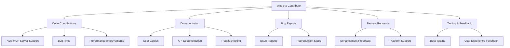
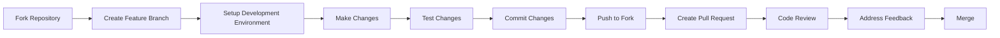
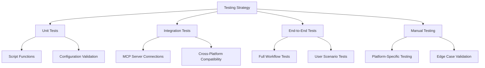
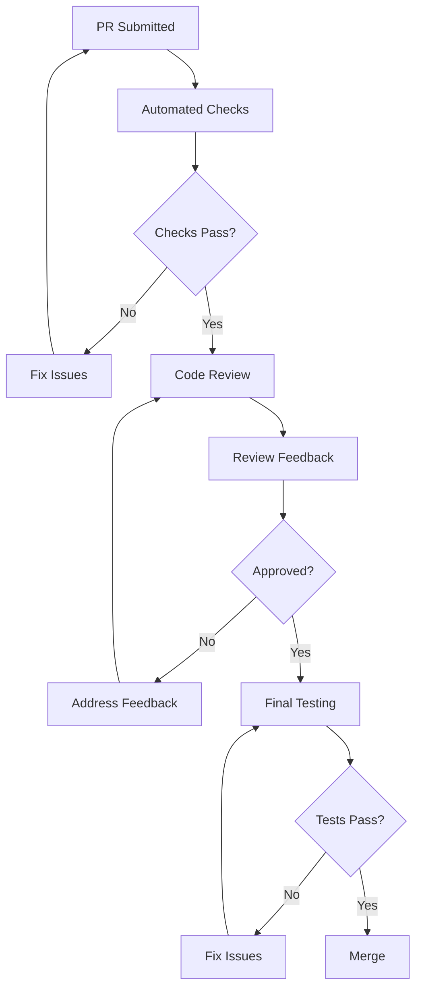
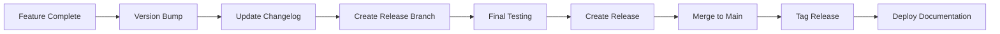

# Contributing Guide
## Claude MCP Servers Configuration

## Document Control
| Field | Value |
|-------|-------|
| Document Version | 1.0 |
| Last Updated | July 2025 |
| Status | **ACTIVE** |
| Document Owner | Development Team |
| Audience | Contributors, Developers, Open Source Community |

---

## 1. Welcome Contributors

Thank you for your interest in contributing to the Claude MCP Server Toolkit! This guide will help you get started with development, understand our standards, and contribute effectively to the project.

### 1.1. Ways to Contribute



#### Code Contributions
- Add support for new MCP servers
- Fix bugs and improve reliability
- Enhance performance and security
- Improve cross-platform compatibility

#### Documentation
- Improve user guides and tutorials
- Add troubleshooting scenarios
- Create video tutorials or blog posts
- Translate documentation

#### Community Support
- Help other users in issues and discussions
- Test new features and provide feedback
- Share your use cases and workflows

---

## 2. Development Setup

### 2.1. Prerequisites

Before you start development, ensure you have:

```bash
# Required tools
- Git 2.30+
- Docker Desktop 4.0+
- Node.js 18+ and npm 8+
- Bash shell (or Git Bash on Windows)
- Code editor (VS Code recommended)

# Optional but recommended
- jq (for JSON processing)
- curl (for testing)
- Make (for automation)
```

### 2.2. Development Environment Setup

#### Step 1: Fork and Clone
```bash
# Fork the repository on GitHub, then clone your fork
git clone https://github.com/YOUR_USERNAME/claude-mcp-server-toolkit.git
cd claude-mcp-server-toolkit

# Add upstream remote
git remote add upstream https://github.com/aporb/claude-mcp-server-toolkit.git
```

#### Step 2: Environment Configuration
```bash
# Copy environment template
cp .env.template .env.dev

# Edit with development credentials (use test tokens)
nano .env.dev

# Set development environment
export NODE_ENV=development
export MCP_ENV=development
```

#### Step 3: Development Dependencies
```bash
# Install development tools
npm install -g @modelcontextprotocol/inspector
npm install -g mcp-server-test

# Make scripts executable
chmod +x scripts/*.sh
chmod +x vscode-integration/*.sh

# Build development images
bash scripts/build-memory-bank.sh
```

#### Step 4: Verify Setup
```bash
# Run health check
bash scripts/health-check.sh

# Test MCP server connections
bash scripts/test-mcp-connections.sh

# Run development server
bash vscode-integration/start-servers.sh
```

### 2.3. Development Workflow



#### Branch Management
```bash
# Create feature branch
git checkout -b feature/add-new-mcp-server

# Keep branch updated
git fetch upstream
git rebase upstream/main

# Push changes
git push origin feature/add-new-mcp-server
```

---

## 3. Code Standards and Conventions

### 3.1. General Principles

- **Simplicity**: Keep solutions simple and maintainable
- **Reliability**: Code should be robust and handle errors gracefully
- **Security**: Follow security best practices
- **Documentation**: Code should be self-documenting with clear comments
- **Testing**: All changes should be thoroughly tested

### 3.2. Shell Script Standards

#### File Structure
```bash
#!/bin/bash
# Script Description: Brief description of what this script does
# Usage: script-name.sh [options] [arguments]
# Author: Your Name
# Version: 1.0

set -euo pipefail  # Strict error handling

# Constants
readonly SCRIPT_DIR="$(cd "$(dirname "${BASH_SOURCE[0]}")" && pwd)"
readonly PROJECT_ROOT="$(cd "$SCRIPT_DIR/.." && pwd)"

# Functions
function main() {
    # Main script logic
}

function cleanup() {
    # Cleanup on exit
    trap - EXIT
}

# Setup
trap cleanup EXIT

# Execute
main "$@"
```

#### Naming Conventions
```bash
# Variables: lowercase with underscores
local server_name="github-mcp"
readonly config_file="config.json"

# Functions: lowercase with underscores
function start_mcp_server() {
    # function implementation
}

# Constants: uppercase with underscores
readonly MAX_RETRIES=3
readonly DEFAULT_TIMEOUT=30
```

#### Error Handling
```bash
# Check command success
if ! docker --version > /dev/null 2>&1; then
    echo "ERROR: Docker is not installed or not running" >&2
    exit 1
fi

# Function with error handling
function safe_execute() {
    local cmd="$1"
    local max_retries="${2:-3}"
    
    for i in $(seq 1 "$max_retries"); do
        if eval "$cmd"; then
            return 0
        fi
        echo "WARNING: Attempt $i failed, retrying..." >&2
        sleep 2
    done
    
    echo "ERROR: Command failed after $max_retries attempts: $cmd" >&2
    return 1
}
```

### 3.3. JSON Configuration Standards

#### Configuration File Format
```json
{
  "mcpServers": {
    "server-name": {
      "command": "command-to-run",
      "args": ["arg1", "arg2"],
      "env": {
        "ENV_VAR": "value"
      },
      "cwd": "/optional/working/directory",
      "timeout": 30
    }
  }
}
```

#### Validation
- All JSON files must be valid and properly formatted
- Use descriptive server names (kebab-case)
- Include all required fields
- Use environment variables for sensitive data

### 3.4. Documentation Standards

#### Code Comments
```bash
# Single line comments for brief explanations
readonly CONFIG_FILE="config.json"  # Configuration file path

# Multi-line comments for complex logic
# This function handles the complex process of:
# 1. Validating the MCP server configuration
# 2. Starting the server with proper error handling
# 3. Monitoring the server health
function start_mcp_server() {
    # Implementation
}
```

#### README and Documentation
- Use clear, concise language
- Include practical examples
- Keep documentation up-to-date with code changes
- Use Mermaid diagrams for complex workflows

---

## 4. Testing Procedures

### 4.1. Testing Strategy



### 4.2. Automated Testing

#### Script Testing
```bash
# Create test script: tests/test-script-name.sh
#!/bin/bash
source "$(dirname "${BASH_SOURCE[0]}")/../scripts/script-name.sh"

function test_function_name() {
    # Test setup
    local test_input="test_value"
    local expected_output="expected_result"
    
    # Execute function
    local actual_output
    actual_output=$(function_name "$test_input")
    
    # Assert result
    if [[ "$actual_output" == "$expected_output" ]]; then
        echo "✓ test_function_name passed"
        return 0
    else
        echo "✗ test_function_name failed: expected '$expected_output', got '$actual_output'"
        return 1
    fi
}

# Run tests
test_function_name
```

#### Integration Testing
```bash
# Test MCP server connections
function test_mcp_server_connection() {
    local server_name="$1"
    
    echo "Testing $server_name connection..."
    
    # Test initialization
    local init_response
    init_response=$(echo '{"jsonrpc":"2.0","id":1,"method":"initialize","params":{"protocolVersion":"2024-11-05","capabilities":{},"clientInfo":{"name":"test","version":"1.0"}}}' | bash "scripts/${server_name}-connector.sh" 2>&1)
    
    if echo "$init_response" | grep -q '"jsonrpc":"2.0"'; then
        echo "✓ $server_name initialization successful"
        return 0
    else
        echo "✗ $server_name initialization failed: $init_response"
        return 1
    fi
}
```

### 4.3. Manual Testing Checklist

#### Before Submitting PR
- [ ] All scripts execute without errors
- [ ] MCP servers start successfully
- [ ] Configuration files are valid JSON
- [ ] Health check passes on clean system
- [ ] Documentation is updated
- [ ] Examples work as described

#### Cross-Platform Testing
- [ ] macOS compatibility verified
- [ ] Linux (Ubuntu) compatibility verified  
- [ ] Windows (Git Bash/WSL) compatibility verified
- [ ] Docker functionality on all platforms
- [ ] Node.js MCP servers work correctly

#### Platform-Specific Testing
- [ ] Claude Desktop integration works
- [ ] Claude Code integration works
- [ ] VS Code/Cline integration works
- [ ] Configuration files are in correct locations
- [ ] Permissions are set correctly

---

## 5. Pull Request Process

### 5.1. PR Guidelines

#### Before Creating PR
```bash
# Ensure branch is up to date
git fetch upstream
git rebase upstream/main

# Run all tests
bash scripts/test-all.sh

# Run health check
bash scripts/health-check.sh

# Check code style
bash scripts/lint-scripts.sh
```

#### PR Title Format
```
type(scope): brief description

Examples:
feat(github-mcp): add support for organization repositories
fix(memory-bank): resolve container cleanup issue
docs(readme): update Claude Desktop setup instructions
refactor(scripts): improve error handling in health checks
```

#### PR Description Template
```markdown
## Description
Brief description of the changes made.

## Type of Change
- [ ] Bug fix (non-breaking change which fixes an issue)
- [ ] New feature (non-breaking change which adds functionality)
- [ ] Breaking change (fix or feature that would cause existing functionality to not work as expected)
- [ ] Documentation update
- [ ] Refactoring (no functional changes)

## Testing Performed
- [ ] Unit tests added/updated
- [ ] Integration tests pass
- [ ] Manual testing completed
- [ ] Cross-platform compatibility verified

## Platforms Tested
- [ ] macOS
- [ ] Linux (Ubuntu)
- [ ] Windows (Git Bash/WSL)

## AI Platforms Tested
- [ ] Claude Desktop
- [ ] Claude Code
- [ ] VS Code/Cline

## Screenshots (if applicable)
Include screenshots of new features or UI changes.

## Additional Notes
Any additional information reviewers should know.
```

### 5.2. Review Process



#### What Reviewers Look For
- **Functionality**: Does the code work as intended?
- **Code Quality**: Is the code clean, readable, and maintainable?
- **Testing**: Are there adequate tests for the changes?
- **Documentation**: Is documentation updated appropriately?
- **Security**: Are there any security implications?
- **Compatibility**: Does it work across supported platforms?

#### Addressing Review Feedback
```bash
# Make requested changes
git add changed-files
git commit -m "address review feedback: specific changes made"

# Push updates
git push origin feature-branch

# The PR will automatically update
```

---

## 6. Issue Reporting and Feature Requests

### 6.1. Bug Reports

#### Before Reporting
1. **Search existing issues** to avoid duplicates
2. **Test with latest version** to ensure bug still exists
3. **Reproduce on clean environment** if possible
4. **Gather diagnostic information**

#### Bug Report Template
```markdown
## Bug Description
Clear and concise description of what the bug is.

## Steps to Reproduce
1. Go to '...'
2. Click on '....'
3. Run command '....'
4. See error

## Expected Behavior
What you expected to happen.

## Actual Behavior
What actually happened.

## Environment
- OS: [e.g. macOS 13.0]
- Docker Version: [e.g. 24.0.2]
- Node.js Version: [e.g. 18.16.0]
- AI Platform: [e.g. Claude Desktop 0.7.1]

## Diagnostic Information
```bash
# Include output from:
bash scripts/health-check.sh
```

## Additional Context
Add any other context about the problem here.
```

### 6.2. Feature Requests

#### Feature Request Template
```markdown
## Feature Description
Clear and concise description of the feature you'd like to see.

## Problem Statement
What problem does this feature solve?

## Proposed Solution
Describe your proposed solution.

## Alternative Solutions
Describe alternative solutions you've considered.

## Use Cases
Describe specific use cases for this feature.

## Implementation Considerations
Any technical considerations or constraints.

## Additional Context
Any other relevant information.
```

---

## 7. Code Review Guidelines

### 7.1. For Authors

#### Preparing for Review
- **Small, focused PRs**: Keep changes small and focused on a single issue
- **Clear commit messages**: Use descriptive commit messages
- **Self-review first**: Review your own code before submitting
- **Update documentation**: Ensure documentation reflects changes
- **Add tests**: Include tests for new functionality

#### During Review
- **Respond promptly**: Address feedback in a timely manner
- **Be open to feedback**: Consider suggestions constructively
- **Ask questions**: Clarify unclear feedback
- **Test suggestions**: Verify that suggested changes work

### 7.2. For Reviewers

#### Review Focus Areas
1. **Correctness**: Does the code do what it's supposed to do?
2. **Readability**: Is the code easy to understand?
3. **Maintainability**: Will this code be easy to maintain?
4. **Performance**: Are there any performance implications?
5. **Security**: Are there any security concerns?
6. **Testing**: Is the code adequately tested?

#### Review Best Practices
- **Be constructive**: Provide specific, actionable feedback
- **Explain reasoning**: Help authors understand why changes are needed
- **Suggest alternatives**: Offer concrete suggestions for improvement
- **Acknowledge good work**: Recognize well-written code
- **Be timely**: Review PRs promptly to maintain development velocity

---

## 8. Release Process

### 8.1. Versioning Strategy

We follow [Semantic Versioning](https://semver.org/):
- **MAJOR**: Breaking changes
- **MINOR**: New features (backward compatible)
- **PATCH**: Bug fixes (backward compatible)

### 8.2. Release Workflow



#### Pre-Release Checklist
- [ ] All tests passing
- [ ] Documentation updated
- [ ] CHANGELOG.md updated
- [ ] Version numbers bumped
- [ ] Security audit completed
- [ ] Cross-platform testing completed

---

## 9. Community and Communication

### 9.1. Communication Channels

- **GitHub Issues**: Bug reports and feature requests
- **GitHub Discussions**: General questions and community discussions
- **Pull Requests**: Code contributions and reviews

### 9.2. Code of Conduct

We are committed to providing a welcoming and inclusive environment. Please:

- **Be respectful**: Treat all community members with respect
- **Be patient**: Help new contributors learn and grow
- **Be collaborative**: Work together toward common goals
- **Be inclusive**: Welcome people of all backgrounds and experience levels

### 9.3. Getting Help

If you need help:

1. **Check documentation**: Start with the User Guide and README
2. **Search issues**: Look for similar questions or problems
3. **Create an issue**: Ask specific questions with context
4. **Join discussions**: Participate in community discussions

---

## 10. Development Tools and Resources

### 10.1. Recommended Tools

#### Code Editors
- **VS Code**: Primary recommended editor
  - Extensions: Bash IDE, Docker, GitLens
- **Vim/Neovim**: For terminal-based editing
- **IntelliJ**: Alternative IDE option

#### Development Utilities
```bash
# JSON processing
brew install jq

# Shell script linting
brew install shellcheck

# Docker management
brew install lazydocker

# Git workflow
brew install gh  # GitHub CLI
```

### 10.2. Useful Resources

#### Documentation
- [Model Context Protocol Specification](https://modelcontextprotocol.io)
- [Claude Desktop Documentation](https://claude.ai/download)
- [Docker Documentation](https://docs.docker.com)
- [Bash Scripting Guide](https://tldp.org/LDP/Bash-Beginners-Guide/html/)

#### Testing and Development
- [MCP Inspector](https://github.com/modelcontextprotocol/inspector)
- [Bats Testing Framework](https://github.com/bats-core/bats-core)
- [ShellCheck](https://www.shellcheck.net/)

---

Thank you for contributing to the Claude MCP Server Toolkit! Your contributions help make AI more capable and accessible for developers everywhere.
