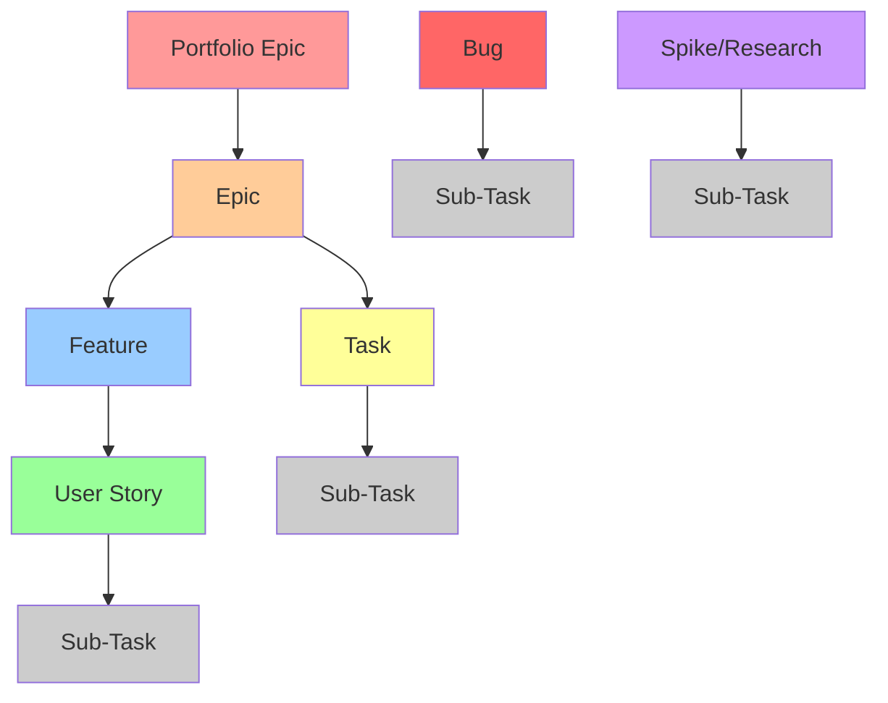
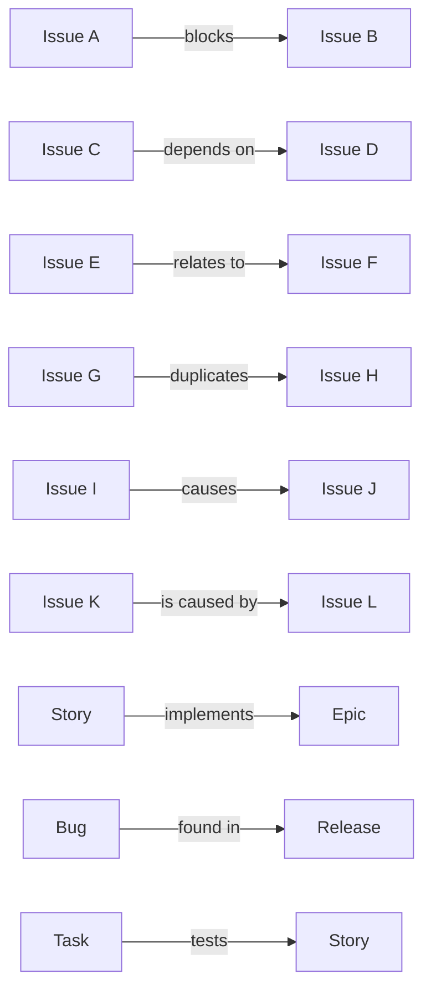
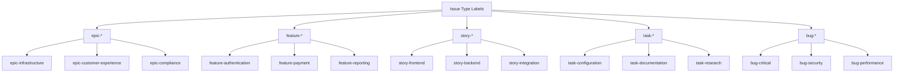
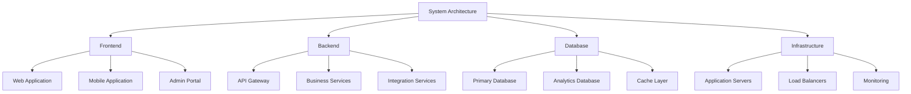
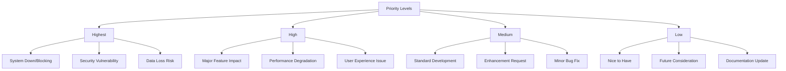
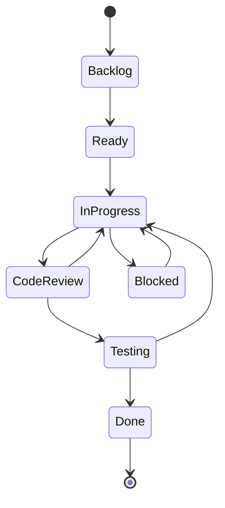
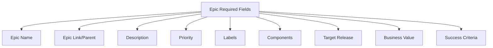
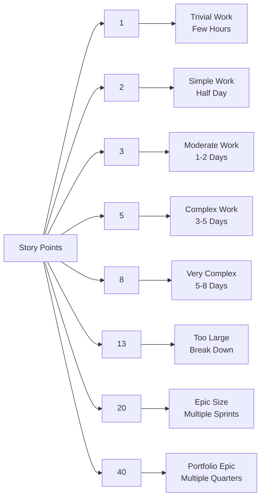

# Jira Standards and Best Practices

## Document Information
- **Document Version**: 1.0
- **Last Updated**: 2025-07-05
- **Document Owner**: [Insert Project Management Office Lead]
- **Review Status**: Draft

## Table of Contents
1. [Jira Standards Overview](#jira-standards-overview)
2. [Issue Hierarchy and Linking](#issue-hierarchy-and-linking)
3. [Naming Conventions](#naming-conventions)
4. [Label Standards](#label-standards)
5. [Component Management](#component-management)
6. [Priority and Severity Guidelines](#priority-and-severity-guidelines)
7. [Status and Workflow Management](#status-and-workflow-management)
8. [Field Usage Standards](#field-usage-standards)
9. [Estimation and Planning](#estimation-and-planning)
10. [Quality and Maintenance](#quality-and-maintenance)

---

## Jira Standards Overview

### Purpose
These standards ensure consistent use of Jira across all projects and teams, enabling effective project tracking, reporting, and cross-team collaboration.

### Scope
**Applies to:**
- All project teams using Jira
- Product management and development teams
- QA and testing teams
- Operations and support teams
- Business stakeholders creating or reviewing issues

### Key Principles
**Consistency**: Standardized approaches across all projects and teams
**Clarity**: Clear, descriptive information that all stakeholders can understand
**Traceability**: Obvious connections between related work items
**Efficiency**: Streamlined processes that support productivity
**Quality**: High-quality information that supports decision-making

---

## Issue Hierarchy and Linking

### Standard Issue Hierarchy


### Issue Type Definitions and Usage

#### Epic
**Purpose**: Large body of work that delivers significant business value
**Duration**: 3-12 months
**Size**: 50-500 story points
**Children**: Features, Tasks, Bugs (direct children)
**Usage**: Strategic initiatives, major feature sets, compliance programs

#### Feature
**Purpose**: Medium-sized functionality that provides user value
**Duration**: 2-8 weeks
**Size**: 10-50 story points
**Children**: User Stories, Tasks, Sub-tasks
**Usage**: Specific product features, system integrations, process improvements

#### User Story
**Purpose**: Small piece of functionality from user perspective
**Duration**: 1-5 days
**Size**: 1-13 story points
**Children**: Sub-tasks only
**Usage**: Individual user-facing features, API endpoints, UI components

#### Task
**Purpose**: Technical or business work not user-facing
**Duration**: 1-5 days
**Size**: 1-13 story points
**Children**: Sub-tasks only
**Usage**: Infrastructure work, documentation, configuration, research

#### Sub-Task
**Purpose**: Granular work item that breaks down larger issues
**Duration**: 2-16 hours
**Size**: 1-5 story points (if team uses points for sub-tasks)
**Children**: None
**Usage**: Specific implementation steps, testing activities, review tasks

#### Bug
**Purpose**: Defect or issue in existing functionality
**Duration**: Variable based on severity
**Size**: 1-8 story points
**Children**: Sub-tasks (for complex bugs)
**Usage**: Production issues, defects found in testing, regression issues

#### Spike/Research
**Purpose**: Investigation or proof of concept work
**Duration**: 1-5 days
**Size**: Time-boxed (not typically estimated in story points)
**Children**: Sub-tasks (for complex research)
**Usage**: Technical feasibility studies, requirements research, prototyping

### Linking Best Practices

#### Epic Linking
- **Epic Link**: Use for Stories and Tasks that contribute to Epic goals
- **Issue Links**: Use "relates to" for loosely coupled work, "depends on" for strict dependencies

#### Parent-Child Relationships
- **Parent**: Always set for Sub-tasks pointing to Story/Task/Bug
- **Children**: Automatically populated, no manual action needed

#### Issue Link Types and Usage


**Link Type Usage Guidelines**:
- **Blocks/Is Blocked By**: Hard dependencies that prevent work from starting
- **Relates To**: Soft dependencies or related work that should be coordinated
- **Duplicates/Is Duplicated By**: Identical or very similar issues
- **Causes/Is Caused By**: Root cause relationships for bugs and issues
- **Implements**: Stories or Tasks that implement Epic functionality
- **Tests**: Testing tasks that validate other work
- **Found In/Fixed In**: Version relationships for bugs and fixes

---

## Naming Conventions

### Issue Summary Standards

#### Epic Summaries
**Format**: [Business Area] - [High-Level Goal]
**Examples**:
- "Customer Experience - Self-Service Portal Implementation"
- "Data Platform - Real-Time Analytics Capability"
- "Compliance - GDPR Privacy Controls"

#### Feature Summaries
**Format**: [Functional Area] - [Specific Feature Name]
**Examples**:
- "User Management - Account Settings Dashboard"
- "Payment Processing - Subscription Billing System"
- "Reporting - Executive Analytics Dashboard"

#### User Story Summaries
**Format**: [User Action] - [Brief Description]
**Examples**:
- "User Login - Password Reset via Email"
- "Admin Management - User Role Assignment"
- "Customer Service - Order Status Inquiry"

#### Task Summaries
**Format**: [Task Type] - [Specific Work Description]
**Examples**:
- "Infrastructure - Redis Cache Configuration"
- "Documentation - API Integration Guide"
- "Research - Payment Gateway Evaluation"

#### Sub-Task Summaries
**Format**: [Component] - [Specific Implementation]
**Examples**:
- "API - Create User Authentication Endpoint"
- "Frontend - Implement Password Reset Form"
- "Database - Add User Audit Log Table"

#### Bug Summaries
**Format**: [Component] - [Issue Description] - [Severity]
**Examples**:
- "Login - Session Timeout Not Working - High"
- "Payment - Credit Card Validation Error - Critical"
- "Dashboard - Chart Loading Performance - Medium"

### Key Naming Guidelines
- Use clear, descriptive language that non-technical stakeholders can understand
- Avoid technical jargon in user-facing issue summaries
- Be specific about the functional area and type of work
- Include severity level for bugs
- Use consistent terminology across related issues

---

## Label Standards

### Label Categories and Usage

#### Issue Type Labels


#### Team and Component Labels
**Team Labels**:
- `team-frontend` - Frontend development team work
- `team-backend` - Backend development team work
- `team-devops` - DevOps and infrastructure team work
- `team-qa` - Quality assurance team work
- `team-design` - UX/UI design team work
- `team-product` - Product management work

**Component Labels**:
- `component-api` - API development and changes
- `component-database` - Database schema and query work
- `component-ui` - User interface components
- `component-integration` - Third-party or system integrations
- `component-security` - Security-related work
- `component-performance` - Performance optimization work

#### Technology Labels
**Frontend Technologies**:
- `tech-react` - React-based development
- `tech-angular` - Angular-based development
- `tech-vue` - Vue.js-based development
- `tech-javascript` - JavaScript development
- `tech-typescript` - TypeScript development

**Backend Technologies**:
- `tech-nodejs` - Node.js development
- `tech-python` - Python development
- `tech-java` - Java development
- `tech-dotnet` - .NET development
- `tech-php` - PHP development

**Infrastructure Technologies**:
- `tech-docker` - Docker containerization
- `tech-kubernetes` - Kubernetes orchestration
- `tech-aws` - Amazon Web Services
- `tech-azure` - Microsoft Azure
- `tech-gcp` - Google Cloud Platform

#### Business and Functional Labels
**Business Domain Labels**:
- `domain-customer` - Customer-facing functionality
- `domain-admin` - Administrative functionality
- `domain-reporting` - Reporting and analytics
- `domain-integration` - Integration and connectivity
- `domain-security` - Security and compliance

**Priority and Planning Labels**:
- `priority-critical` - Must be completed immediately
- `priority-high` - Should be completed this sprint
- `priority-medium` - Can be scheduled in upcoming sprints
- `priority-low` - Can be deferred if necessary

**Release Labels**:
- `release-2025-q1` - Planned for Q1 2025 release
- `release-2025-q2` - Planned for Q2 2025 release
- `hotfix` - Emergency fix for production
- `backlog` - Not yet scheduled for specific release

### Label Usage Guidelines

#### Mandatory Labels
**All Issues Must Have**:
- At least one team label (`team-*`)
- At least one component label (`component-*`)
- At least one priority label (`priority-*`)

**Additional Requirements by Issue Type**:
- **Epics**: Business domain label (`domain-*`)
- **Features**: Technology label (`tech-*`) if technical implementation
- **Bugs**: Severity label (`bug-critical`, `bug-high`, `bug-medium`, `bug-low`)
- **Tasks**: Task type label (`task-configuration`, `task-documentation`, etc.)

#### Label Maintenance
- Review and update labels monthly
- Remove obsolete or unused labels quarterly
- Ensure consistent label usage across projects
- Document custom project-specific labels

---

## Component Management

### Standard Components

#### System Components


#### Functional Components
**User Management**:
- Authentication and authorization
- User profile management
- Role and permission management

**Data Management**:
- Data ingestion and processing
- Data storage and retrieval
- Data analytics and reporting

**Integration**:
- External API integrations
- Internal service communication
- Event processing and messaging

### Component Assignment Guidelines

#### Primary Component Rules
- Each issue must have exactly one primary component
- Primary component indicates which team is primarily responsible
- Secondary components can be added for cross-cutting concerns

#### Component Selection Criteria
- **Frontend**: Issues affecting user interface or user experience
- **Backend**: Issues affecting server-side logic or data processing
- **Database**: Issues affecting data schema, queries, or database performance
- **Infrastructure**: Issues affecting deployment, hosting, or system operations
- **Integration**: Issues affecting external system connections or data exchange

---

## Priority and Severity Guidelines

### Priority Levels and Criteria

#### Priority Definitions


#### Priority Assignment Guidelines

**Highest Priority**:
- Production system outages or critical failures
- Security vulnerabilities with immediate risk
- Data corruption or loss scenarios
- Legal or compliance violations
- Issues blocking entire team or project progress

**High Priority**:
- Major functionality not working as expected
- Significant performance degradation affecting users
- Important features required for upcoming release
- Customer-reported issues affecting business operations
- Dependencies blocking other high-priority work

**Medium Priority**:
- Standard development work for planned features
- Minor bugs that don't significantly impact users
- Enhancement requests with clear business value
- Technical debt that should be addressed soon
- Process improvements and optimizations

**Low Priority**:
- Nice-to-have features without immediate business need
- Minor cosmetic issues that don't affect functionality
- Documentation updates and maintenance tasks
- Research and exploration work
- Future enhancements for consideration

### Bug Severity Guidelines

#### Severity Levels for Bugs

**Critical Severity**:
- Complete system failure or unavailability
- Data loss or corruption
- Security breaches or vulnerabilities
- Payment processing failures
- Legal or regulatory compliance violations

**High Severity**:
- Major functionality completely broken
- Significant performance issues affecting many users
- Workaround exists but is difficult or time-consuming
- Affects primary user workflows
- Customer-reported issues with business impact

**Medium Severity**:
- Functionality partially working or with limitations
- Minor performance issues
- Affects secondary workflows or edge cases
- Easy workaround available
- Cosmetic issues that affect user experience

**Low Severity**:
- Minor functional issues with minimal impact
- Cosmetic problems that don't affect usability
- Documentation errors or omissions
- Issues in rarely used features
- Enhancement requests disguised as bugs

---

## Status and Workflow Management

### Standard Workflow States

#### Development Workflow


#### Status Definitions and Usage

**Backlog**:
- Issue is identified but not yet prioritized or planned
- Needs further analysis or requirements gathering
- Waiting for business decision or resource allocation

**Ready for Development**:
- Issue is fully defined with clear acceptance criteria
- Dependencies are resolved or identified
- Assigned to sprint and has necessary resources
- Team understands scope and technical approach

**In Progress**:
- Active development work is underway
- Developer has started implementation
- Regular progress updates expected
- Blockers should be identified and communicated quickly

**Code Review**:
- Implementation is complete and ready for peer review
- Pull request created with adequate description
- Automated tests passing
- Waiting for reviewer feedback and approval

**Testing**:
- Code review approved and merged
- Deployed to testing environment
- QA team or product owner conducting validation
- Bug fixes may cause return to In Progress

**Blocked**:
- Work cannot proceed due to external dependency
- Waiting for input from stakeholder or external team
- Technical blocker requiring architectural decision
- Resource unavailability preventing progress

**Done**:
- All acceptance criteria met and verified
- Code deployed to production (or appropriate environment)
- Stakeholder approval received
- Documentation updated as needed

### Workflow Transition Rules

#### Required Information for Status Changes
**To Ready for Development**:
- [ ] Acceptance criteria defined
- [ ] Story points estimated
- [ ] Dependencies identified
- [ ] Technical approach understood

**To In Progress**:
- [ ] Developer assigned
- [ ] Sprint assignment confirmed
- [ ] Work breakdown understood
- [ ] Development environment ready

**To Code Review**:
- [ ] Implementation complete
- [ ] Unit tests written and passing
- [ ] Pull request created
- [ ] Self-review completed

**To Testing**:
- [ ] Code review approved
- [ ] Changes merged to main branch
- [ ] Deployed to testing environment
- [ ] Testing instructions provided

**To Done**:
- [ ] All acceptance criteria validated
- [ ] Testing completed successfully
- [ ] Stakeholder approval received
- [ ] Production deployment successful (if applicable)

---

## Field Usage Standards

### Required Fields by Issue Type

#### Epic Required Fields


**Epic Field Requirements**:
- **Epic Name**: Clear, business-focused epic name
- **Description**: Business objective, success criteria, high-level requirements
- **Priority**: Business priority level
- **Labels**: Domain, team, and business labels
- **Components**: Primary business area
- **Target Release**: Expected completion timeframe
- **Reporter**: Product Owner or Business Analyst
- **Epic Color**: Visual identification for planning tools

#### Feature Required Fields
- **Summary**: Clear feature name and functionality
- **Description**: Detailed feature requirements and business value
- **Epic Link**: Connection to parent epic
- **Story Points**: Effort estimation
- **Priority**: Feature priority within epic
- **Labels**: Team, component, and technology labels
- **Components**: Technical areas affected
- **Acceptance Criteria**: Feature-level completion criteria

#### User Story Required Fields
- **Summary**: User action and brief description
- **Description**: User story format ("As a... I want... So that...")
- **Story Points**: Effort estimation (1-13 scale)
- **Priority**: Story priority for sprint planning
- **Labels**: Team, component labels minimum
- **Components**: Primary technical component
- **Acceptance Criteria**: Specific, testable criteria
- **Parent/Epic Link**: Connection to feature or epic

#### Task Required Fields
- **Summary**: Task type and specific work description
- **Description**: Technical objectives and scope of work
- **Story Points**: Effort estimation
- **Priority**: Task priority for sprint planning
- **Labels**: Team, task type labels minimum
- **Components**: Technical area
- **Acceptance Criteria**: Technical completion criteria

### Optional Fields and Usage

#### Useful Optional Fields
**Time Tracking**:
- Original Estimate: Initial effort estimation
- Remaining Estimate: Current effort remaining
- Time Spent: Actual effort logged

**Environment Information**:
- Affects Version: Version where issue was found
- Fix Version: Target version for resolution
- Environment: Development, staging, production

**Business Information**:
- Customer Impact: Number of users affected
- Business Priority: Business stakeholder priority
- Due Date: Hard deadline if applicable

### Field Validation Rules

#### Data Quality Standards
**Text Fields**:
- No empty required fields
- Proper grammar and spelling
- Consistent terminology usage
- Appropriate level of detail

**Numeric Fields**:
- Story points within established scale
- Time estimates in standard units
- Priority levels using defined values

**Date Fields**:
- Realistic timelines based on effort estimates
- Consistent date formats across projects
- Due dates aligned with sprint and release planning

---

## Estimation and Planning

### Story Point Estimation

#### Standard Story Point Scale


#### Estimation Guidelines by Issue Type

**User Stories (1-13 points)**:
- 1 point: Simple UI changes, configuration updates
- 2 points: Basic CRUD operations, simple forms
- 3 points: Moderate business logic, basic integrations
- 5 points: Complex business logic, multiple components
- 8 points: Very complex logic, multiple integrations
- 13 points: Should be broken down into smaller stories

**Tasks (1-13 points)**:
- 1 point: Simple configuration, documentation updates
- 2 points: Basic setup, simple scripts
- 3 points: Moderate configuration, basic automation
- 5 points: Complex setup, integration configuration
- 8 points: Very complex technical work
- 13 points: Should be broken down into smaller tasks

**Bugs (1-8 points)**:
- 1 point: Simple fix, configuration change
- 2 points: Basic code fix, single component
- 3 points: Moderate fix, multiple files
- 5 points: Complex fix, root cause analysis required
- 8 points: Very complex fix, architectural changes

### Planning Guidelines

#### Sprint Planning Best Practices
**Sprint Capacity**:
- Plan for 70-80% of theoretical capacity
- Account for meetings, code reviews, and unplanned work
- Consider team member availability and experience levels
- Reserve capacity for critical bug fixes

**Story Selection**:
- Prioritize by business value and dependencies
- Ensure stories meet Definition of Ready
- Include mix of feature work and technical debt
- Consider risk and complexity distribution

#### Release Planning
**Epic Planning**:
- Break epics into features early in process
- Identify cross-team dependencies upfront
- Plan buffer time for integration and testing
- Align epic delivery with business milestones

**Feature Planning**:
- Complete feature breakdown before sprint planning
- Identify and resolve dependencies between features
- Plan features to deliver incremental value
- Consider user feedback and iteration cycles

---

## Quality and Maintenance

### Data Quality Standards

#### Issue Quality Checklist
**Content Quality**:
- [ ] Summary is clear and descriptive
- [ ] Description provides adequate context
- [ ] Acceptance criteria are specific and testable
- [ ] Business value is clearly articulated
- [ ] Technical requirements are well-defined

**Metadata Quality**:
- [ ] Appropriate issue type selected
- [ ] Priority accurately reflects business need
- [ ] Labels follow established conventions
- [ ] Components correctly identify responsible teams
- [ ] Links and relationships are accurate

**Completeness Quality**:
- [ ] All required fields completed
- [ ] Dependencies identified and linked
- [ ] Estimates provided where appropriate
- [ ] Success criteria clearly defined
- [ ] Stakeholders properly identified

### Maintenance Procedures

#### Regular Maintenance Tasks

**Weekly Maintenance**:
- Review and update issue statuses
- Identify and resolve stale or blocked issues
- Update sprint progress and burndown metrics
- Communicate status changes to stakeholders

**Monthly Maintenance**:
- Clean up completed and obsolete issues
- Review and update label usage
- Analyze sprint velocity and estimation accuracy
- Update team capacity and planning metrics

**Quarterly Maintenance**:
- Review and update component definitions
- Analyze workflow efficiency and bottlenecks
- Update templates and standards documentation
- Train new team members on Jira practices

#### Quality Metrics and Monitoring

**Issue Quality Metrics**:
- Percentage of issues with complete required fields
- Average time issues spend in each status
- Frequency of status transitions and rework
- Accuracy of effort estimates vs. actual time

**Process Quality Metrics**:
- Sprint commitment accuracy (planned vs. completed)
- Velocity trends and predictability
- Defect rates and escape rates to production
- Team satisfaction with Jira processes

### Continuous Improvement

#### Feedback Collection
**Team Retrospectives**:
- Regular discussion of Jira usage challenges
- Identification of process improvement opportunities
- Feedback on template effectiveness and clarity
- Suggestions for workflow optimization

**Stakeholder Feedback**:
- Business stakeholder input on issue visibility
- Product owner feedback on planning effectiveness
- Customer feedback incorporation into issue tracking
- Executive reporting and metrics satisfaction

#### Process Evolution
**Standards Updates**:
- Regular review and update of naming conventions
- Evolution of label taxonomy based on usage
- Workflow adjustments based on team feedback
- Template improvements based on quality analysis

**Tool Enhancement**:
- Evaluation of Jira configuration optimization
- Integration with other development tools
- Automation opportunities identification
- Reporting and dashboard improvements

---

## Appendices

### Appendix A: Quick Reference Guide

#### Issue Type Selection
```
Epic: Large business initiative (3-12 months)
Feature: Medium functionality (2-8 weeks)
Story: Small user-facing work (1-5 days)
Task: Technical or non-user work (1-5 days)
Sub-task: Granular work breakdown (2-16 hours)
Bug: Defect in existing functionality
Spike: Research or investigation work
```

#### Label Quick Reference
```
Teams: team-frontend, team-backend, team-devops, team-qa
Components: component-api, component-ui, component-database
Technologies: tech-react, tech-nodejs, tech-docker
Priorities: priority-critical, priority-high, priority-medium, priority-low
Domains: domain-customer, domain-admin, domain-reporting
```

### Appendix B: Common Issue Patterns

#### Epic → Feature → Story Breakdown Example
```
Epic: "Customer Experience - Self-Service Portal"
├── Feature: "User Account Management"
│   ├── Story: "User Registration with Email Verification"
│   ├── Story: "User Profile Editing and Updates"
│   └── Story: "Password Reset via Email"
├── Feature: "Order Management Dashboard"
│   ├── Story: "Order History Display"
│   ├── Story: "Order Status Tracking"
│   └── Story: "Order Cancellation Request"
└── Feature: "Support Ticket System"
    ├── Story: "Support Ticket Creation"
    ├── Story: "Ticket Status Updates"
    └── Story: "Support Agent Communication"
```

### Appendix C: Integration with Development Tools

#### Git Integration Best Practices
**Commit Message Format**:
```
[PROJ-123] Add user authentication endpoint

- Implement POST /api/auth/login
- Add JWT token generation
- Include rate limiting for security
- Add unit tests for happy and error paths

Closes PROJ-123
```

**Branch Naming Conventions**:
```
feature/PROJ-123-user-authentication
bugfix/PROJ-124-login-session-timeout
hotfix/PROJ-125-payment-processing-error
```

#### CI/CD Integration
**Build Status Updates**:
- Automatically update Jira issues with build results
- Link deployment status to release issues
- Track test results and coverage metrics
- Notify stakeholders of deployment completion

---

**Document Prepared By**: [Insert Project Management Office Lead]
**Document Reviewed By**: [Insert Development Team Lead]
**Document Approved By**: [Insert Engineering Manager]
**Next Review Date**: [Insert review date 180 days from creation]